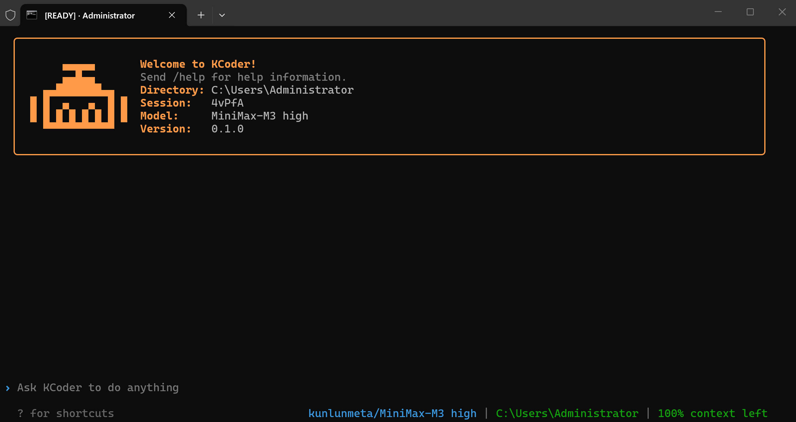
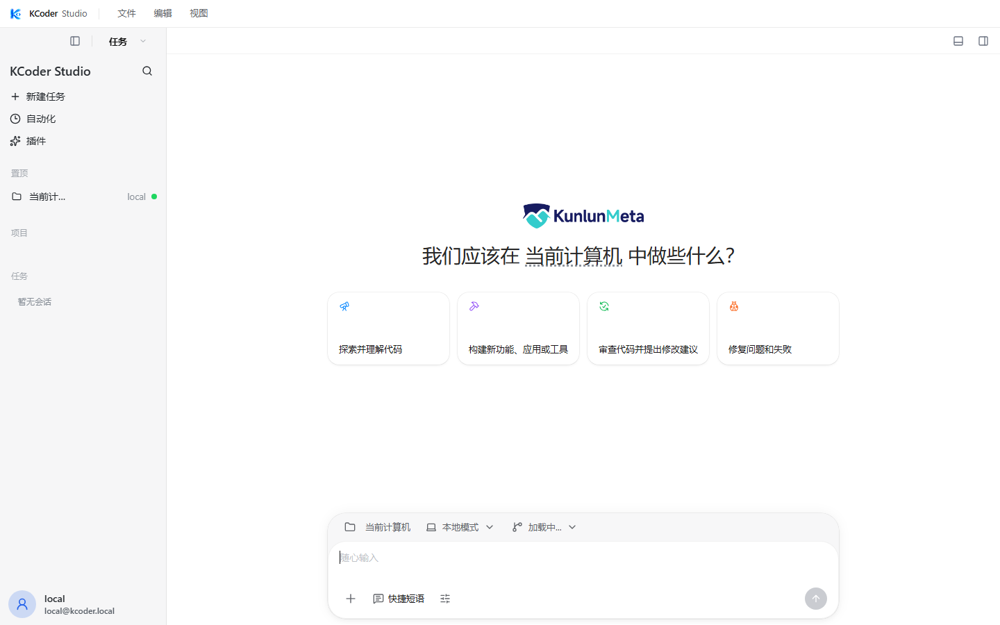

# KCoder

KCoder is an agentic AI coding platform built by **KunlunMeta Artificial Intelligence Technology (Shanghai) Co., Ltd.** It is an engineering-grade agent runtime rather than a wrapper that prints model output to the terminal: model providers, the agent loop, the tool system, permissions and sandboxing, structured long-term memory, Skills, spec-driven workflows, plugin hooks, MCP, sub-agents, session state, a terminal TUI, background daemons, Goal Pro long-objective verification, and desktop/Web/mobile access through KCoder Studio.

This repository is the public source snapshot of KCoder and the home of its installer releases.

What is inside:

- `crates/` — the Rust workspace: cross-crate contracts (`kcoder_types`), configuration (`kcoder_config`), provider transports (`kcoder_api`), session state (`kcoder_state`), orchestration (`kcoder_engine`), tools (`kcoder_tools`), permissions (`kcoder_permissions`), hooks and plugins (`kcoder_hooks`, `kcoder_plugins`), MCP (`kcoder_mcp`), specs (`kcoder_specs`), workflows (`kcoder_workflow`), memory and skills (`kcoder_memory`, `kcoder_skills`), the TUI (`kcoder_repl`), the binary and app-server (`kcoder_cli`), and the app-server wire contract (`kcoder_app_protocol`). The [Repository Layout](#repository-layout) section lists every crate.
- `apps/kcoder-studio/` — KCoder Studio: the Electron desktop host, React Web renderer, Expo Mobile client, and Gateway. Independent Tauri builds remain available for development and compatibility verification; the standard desktop installer uses Electron.
- `scripts/` and `tools/` — build, installer and verification helpers used by the release flow.

The single canonical entry point is `kcoder`: the installer, docs, scripts, and everyday usage all standardize on it. `kcoder --help` or `-h` is a read-only probe and does not initialize any user configuration.

## Screenshots

Terminal TUI:



KCoder Studio (desktop app):



## Current Positioning

KCoder aims to be more than a wrapper that simply prints model output to the terminal — it is an auditable, extensible, locally runnable engineering-grade agent runtime:

- Clear boundaries between providers, engine, tools, TUI, memory, permissions, specs, hooks, workflows, etc. through modular crate splits.
- Unified `Tool` trait managing built-in tools, MCP tools, and future plugin contributions.
- Permission modes, Landlock sandbox, hook events, audit logs, and tool output truncation reduce automation risk.
- Structured SQLite (+FTS5) memory, observer, privacy policy, and `/memories status` support long-term context.
- A spec-driven workflow turns engineering discipline, change planning, TDD, verification, and archival flows into tool-executable workflows.
- TUI queue, real-time rendering, tool status, background sub-agents, `/goal` objective progression, and `/goal-pro` strict verification support long tasks.
- app-server (JSON-RPC over stdio) and Gateway act as a machine-readable backend for desktop/Web/mobile clients, enabling KCoder Studio multi-platform access.

## Quick Start

Windows users can install the packaged **KCoder Studio** (desktop app with the bundled CLI and browser resource) from
[Releases](https://github.com/KunlunMeta-dev/Kcoder/releases): download `KCoder-Studio-Setup-<version>-win-x64.exe` and verify it
against the matching `SHA256SUMS.txt` published with every build. The rest of this section builds from source.

Studio entry points have different packaging boundaries:

| Entry point | Delivery and runtime |
| --- | --- |
| Windows desktop | Electron NSIS `.exe`; includes the local CLI, Gateway, renderer and browser resources; also connects to SSH Linux targets. |
| Linux desktop | Electron AppImage or a source launch; uses the same Gateway and app-server contract. |
| Studio Web | Browser UI served by a deployed Gateway; it does not install or start a local Rust runtime in the browser. |
| Mobile Web | Expo Web client connected to the Gateway; separate client preferences and the same target-owned sessions and configuration. |
| Android / iOS | Expo native source targets; Mobile Web validation does not establish physical-device or app-store release acceptance. |
| Tauri | Independent development/compatibility build; its verification does not replace testing the Electron installer. |
| Windows remote ZIP | Thin validation client without a local CLI; requires an existing Gateway. |

CLI, Studio and Mobile versions are independent. Match an installer to its release's source commit and resource checksums; a successful source build does not establish that an installed package passed validation.

The local release installer builds `kcoder` from the current checkout without contacting GitHub Releases or cloud CI,
nor invoking `sudo`, reading source `.env`, or importing any credentials. Prepare a Rust toolchain (Rust 1.95) first and enter the repo:

```bash
git clone https://github.com/KunlunMeta-dev/Kcoder.git
cd Kcoder
scripts/install/installers/cli-release.sh
export PATH="$HOME/.local/bin:$PATH"
kcoder --version
```

On Linux the build needs the Secret Service client library used by the OS credential store:
`sudo apt install libdbus-1-dev` (or the equivalent for your distribution).

By default it executes `cargo build --release --locked`; if a local release binary already exists, use
`KCODER_RELEASE_BIN=<path>` to skip the build. The first run will create the missing
`~/.config/kcoder/settings.json`; existing files will not be overwritten. See the complete boundary between installer local builds and server deployments in
`scripts/install/README.md`.

Windows PowerShell users run a local MSVC release build inside the checkout:

```powershell
git clone https://github.com/KunlunMeta-dev/Kcoder.git
Set-Location Kcoder
.\scripts\install\installers\cli-release.ps1
$env:Path += ";$env:LOCALAPPDATA\Programs\KCoder\bin"
kcoder.exe --version
```

Uninstall by running `scripts/install/installers/uninstall.ps1` (or `uninstall.sh`); user configuration, credentials, and history are preserved.

To install system-wide commands from source, use `scripts/install/installers/cli-release-server.sh` (release) and
`cli-dev-server.sh` (debug). Both must run as root and only update `/usr/local/bin` system entries.
The release entry uses the formal `~/.config/kcoder`, and does not import dev configuration or repo credentials; the debug entry uses an isolated
`~/.config/kcoder-dev` and syncs dev configuration and provider credentials.

The Linux system release installer also prepares a pinned version of Google Chrome for Testing; the complete
Studio package for Windows/Linux also ships this resource. For offline input, SHA-256 verification, and uncovered CLI package boundaries, see
`scripts/release/README.md` (Chrome packaging notes). Browser dependency download failures will be flagged explicitly and do not affect CLI installation.

First-time configuration:

```bash
kcoder config init
kcoder auth login --provider kunlunmeta

# Launch TUI in any project directory.
cd /path/to/project
kcoder
```

You can also use `kcoder auth import --env-file .env` to import credentials for all configured Providers from dotenv at once.
API keys are always written to `credentials.json` with permission `0600`, not `settings.json`.

If you only need standalone release attachments, use `scripts/release/package_release.sh` / `package_release.ps1` to generate
CLI tar.gz or ZIP (including the `lib/kcoder/rg` bundled for the target platform); the CLI release installer does not download these cloud attachments by default.
On Linux hosts, you can use `scripts/release/package_windows_release.sh` to cross-build a Windows GNU CLI ZIP.

KCoder Studio (desktop/Web/mobile) launch:

```bash
scripts/install/installers/studio-client.sh  # first-time user-level install of the kcoder-studio command
kcoder-studio --dev                            # start Electron directly, no systemd dependency
```

For a managed mode that survives terminal exit:

```bash
scripts/launch/kcoder-studio-web-dev.sh            # default systemd-managed dev profile
scripts/launch/kcoder-studio-web-release.sh        # default systemd-managed release profile
scripts/launch/kcoder-studio-web-dev.sh --direct   # optional: foreground Electron
```

The managed mode installs and starts four systemd units: Gateway 4173 only listens on loopback, Studio Web 4174 and Mobile Web 4175
default to listening on all local network interfaces on the corresponding ports, and the Expo bundler 14175 listens only on loopback.
`kcoder-studio --dev` or `--direct` is launched by Electron which spawns a loopback Gateway; the Gateway manages a profile-matching `kcoder app-server` on demand and cleans up child processes on exit. Plain CLI installation only provides the terminal command and does not configure systemd. See the Studio
Gateway security model and app-server protocol details in the [KCoder Studio](#kcoder-studio) section below.

After installation you can run directly in any project directory:

```bash
kcoder
kcoder "run the tests and fix failures"
```

## First run

```bash
kcoder config path                      # where settings live
kcoder auth login --provider <provider> # API keys go to credentials, never to settings
kcoder "summarize this repository"
```

Providers, endpoints, models and runtime knobs belong to `settings.json`; API keys belong to `credentials.json` and are written by `kcoder auth`. JSONC comments and trailing commas are supported, and `settings.schema.jsonc` in the same directory provides editor validation.

## Configuration

KCoder uses layered configuration; later-loaded files override earlier-loaded scalars and arrays; nested objects are merged field by field,
so the project layer can either change a single subfield or use an empty array to clear user-layer lists:

| File | Scope | Git | Suitable for |
|------|------|-----|----------|
| `~/.config/kcoder/settings.json` | User | N/A | Models and personal preferences common to all projects |
| `<kcoder executable directory>/settings.json` | Executable directory | Managed with the release package or deployment directory | Runtime configuration from release packages, portable deployments, or administrator |
| `.kcoder/settings.json` | Project | Recommended to commit | Team-shared permissions, MCP, and project model settings |
| `.kcoder/settings.local.json` | Project personal | Auto-ignored by `.kcoder/.gitignore` | Per-user override for the current project |

The full priority from low to high: embedded defaults (`settting_inline.jsonc` → schema) → user configuration →
executable directory configuration → project configuration → project local configuration → explicit `--settings-file` overlay (repeatable, later has higher priority) →
environment variables → CLI arguments. When launched from a project subdirectory, it walks upward to find the nearest `.kcoder` configuration; the program does not auto-scan the workspace `.env`,
and `.env` under the user profile only supplements missing environment variables.

Each launch atomically replaces the bundled `settings.schema.jsonc` into the user configuration directory for editor validation and completion;
the configuration metadata `meta.config_version` is currently `1`; future versions will explicitly reject old files at load time. The only Provider bundled
is `kunlunmeta`; when `providers` is declared in any explicit configuration file, only the union of names declared by these files is kept; removed configurations must not be re-added via
defaults, imports, or bootstrap packages.

Common commands:

```bash
kcoder config path
kcoder config init --scope user
kcoder config list --sources
kcoder config get model --source
kcoder config set model MiniMax-M3
kcoder config set permission_mode auto --scope project
kcoder config unset permission_mode --scope project
kcoder config import --file team-settings.jsonc --scope project
kcoder config migrate
kcoder config validate
```

`config set` first parses the value as JSON (`true`/`false`/numbers/arrays/objects use valid JSON, others are treated as strings),
and after each modification it reloads and validates the merged result; `config set/unset` triggers the `ConfigChange` lifecycle hook and rejects
secret fields like `*_api_key`. Write scopes are only `user`, `project`, `local`; the program directory configuration belongs to the deployment environment and should not be modified via command.

Model services use the centralized `providers` configuration. Object keys are Provider IDs, and also determine the endpoint, authentication namespace, default model,
and model capabilities. `config migrate` only fills missing fields, does not overwrite user values, and value-preserving migrates the legacy top-level provider/model/endpoint/token
fields into the current Provider to prevent them from continuing to override new configuration under a new Provider:

```json
{
  "active_provider": "kunlunmeta",
  "providers": {
    "kunlunmeta": {
      "api_format": "anthropic_messages",
      "endpoint": "http://127.0.0.1:8000",
      "default_model": "MiniMax-M3",
      "reasoning_effort": "high",
      "context_window_tokens": 1048576,
      "output_headroom_tokens": 100000,
      "max_output_tokens": 100000,
      "request_timeout_secs": 300,
      "no_proxy": true,
      "extra_body": {}
    }
  }
}
```

The `kunlunmeta` endpoint defaults to `http://127.0.0.1:8000` (example environment, please override based on actual deployment), and the default model is `MiniMax-M3`; can be overridden by
`KUNLUNMETA_BASE_URL` and `KUNLUNMETA_BASE_MODEL` respectively. `api_format` supports `anthropic_messages`,
`openai_responses`, `openai_chat_completions`, and `gemini_generate_content`. API keys do not belong to Provider
configuration and continue to be saved independently by `auth` to `credentials.json`. `extra_body` can configure provider extension request fields such as `temperature`, `top_p`,
thinking budget, etc.; internal or local endpoints can set `"no_proxy": true` to ignore process HTTP proxies.
Summary models can reference a full profile via `summary_profile`; MoA's reference/aggregator model slots can add
`"profile": "profile-name"` to avoid inheriting the main model's protocol and endpoint. Other Providers like local, OpenAI-compatible, etc. must fully declare
endpoint, protocol, default model, and model capabilities; Provider IDs are case-sensitive and must exactly match the `auth login --provider`
and `credentials.json` root key.

`KCODER_CONFIG_DIR` (or the compatible `KCODER_HOME`) can override the user configuration directory, suitable for containers, tests, and multiple
account isolation. Credential management:

```bash
kcoder auth login --provider kunlunmeta
kcoder auth import --env-file .env
kcoder auth status
kcoder auth logout --provider kunlunmeta
```

`credentials.json` uses an authentication map with Provider IDs as root keys:

```json
{
  "kunlunmeta": { "type": "api", "key": "..." }
}
```

Environment variables still apply for CI or ad hoc runs, e.g. `KUNLUNMETA_BASE_API_KEY`, `KCODER_PROVIDER`,
`KCODER_MODEL`, and `KCODER_PERMISSION_MODE`. `--credential-env-file` can supply a dotenv credential file for a single process.
The final credential priority: explicit CLI credential argument > `credentials.json` > legacy compat-period settings
credential fields > KunlunMeta environment variables.

### Trust and Skill Preflight

When unattended tasks depend on project Skills, explicitly declare and only trust the target root before starting:

```bash
kcoder trust status --path /srv/project
kcoder trust add --path /srv/project
kcoder trust never --path /srv/project
kcoder trust revoke --path /srv/project
kcoder --cwd /srv/project --require-skill ci-triage --json "execute CI triage"
```

`trust` reads and writes `FolderTrustStore` (located in the configuration directory); `--require-skill` is repeatable and preflights before the first model request:
when the Skill is not installed, the project is not trusted, the tool profile does not expose `skill`, or permissions deny, KCoder first returns a structured `blocked`
(`preflight_failed` + `termination_reason=required_skill_unavailable`, `resume_safe=true`),
without first consuming model turns. When the directory is not trusted, project-layer MCP servers are stripped, project skills load with a trust flag,
and the TUI prompts interactively about projects with extension surfaces before starting.

## Provider Configuration

Model provider, endpoint, model, and runtime parameters live in `settings.json`; API keys live in
`credentials.json`; you can also use environment variables or `auth login` to import credentials:

```bash
kcoder auth login --provider kunlunmeta
kcoder auth login --provider anthropic
```

For development debugging, use `KCODER_BINARY_POLICY` (`debug`, `build`, or `latest`) and
`KCODER_RELEASE_BIN_DIRS` to control binary sources; shared launch logic lives in
`scripts/install/lib/launcher.sh` (binary policy, config migrate/import, credential import).

## Architecture Overview

Rough data flow for a conversation:

```text
CLI / TUI
  -> Settings + provider selection + MCP/plugin discovery + trust gate
  -> QueryEngine
  -> system prompt: project instructions + active skills + memory + tool definitions
  -> Provider streaming response (SSE, retry, incremental tool_use parsing)
  -> PermissionEngine + hooks + sandbox (Landlock)
  -> ToolRegistry / MCP tools / sub-agents / Workflow / cron / goal tools
  -> AppState + MemoryManager + transcript / TUI events
  -> final assistant output, compaction summaries, hooks, session-end memory
```

Startup bootstrap chain: embedded bootstrap (settings/schema/credentials) → `ensure_user_settings_schema` →
`ensure_builtin_skills` (materialize `kcoder-settings`) → `ensure_default_user_settings`. Engine construction runs in parallel:
Landlock sandbox, structured memory registration, hooks/plugin discovery (with trust gate), project instructions frozen into a `<project-instructions>`
synthetic user message (preserving the prompt cache prefix), tool definition caching, checkpoint directory, tool repair index loading,
observer queue, Provider HTTP client warmup (10-second timeout), shell rc environment snapshot asynchronous scheduling, cron scheduler loading.

Core boundaries:

| Layer | Responsibility |
|----|------|
| `kcoder_cli` | CLI arguments, provider selection, headless/JSON events, doctor/auth/trust/config/mcp/plugin/daemon/app-server/tui-dev/moa-plan subcommands |
| `kcoder_api` | Provider clients for Anthropic, OpenAI-compatible, Gemini, Grok, etc. |
| `kcoder_engine` | agent loop, streaming, tool execution and concurrency, permission integration, context compaction (layered/prefire/protocol repair), auto memory, sub-Agent runner, Goal continuation, MoA |
| `kcoder_tools` | built-in tools and `Tool` trait (including orchestration, LSP, OCR, REPL, sandbox, cron, workflow, etc.) |
| `kcoder_repl` | interactive TUI, slash commands, transcript viewport, overlay, composer, rendering and scrolling |
| `kcoder_memory` | structured SQLite memory (+FTS5), observer, privacy policy, summary lifecycle |
| `kcoder_specs` | Spec-driven workflow: initialization, change, validation, verification, sync, archival, and bundled skills |
| `kcoder_hooks` | lifecycle hook events, matcher, execution, effect aggregation |
| `kcoder_permissions` | permission modes, persistent allow/deny, structured rules, bash risk classification, audit |
| `kcoder_plugins` | plugin manifest discovery (with trust gate) and hook contribution loading |
| `kcoder_mcp` | MCP stdio / legacy SSE / Streamable HTTP client, external tool bridging |
| `kcoder_state` | session state, transcript, history, tasks, todos, goal, checkpoint, worktree state |
| `kcoder_workflow` | embedded QuickJS (rquickjs) JS workflow runtime (`Workflow` tool) |
| `kcoder_process_supervisor` | cross-platform process supervisor binary (`kcoder-process-supervisor`) |
| `kcoder_app_protocol` | app-server JSON-RPC wire types (desktop/Web/mobile shared, protocol version `2026-07-27`) |
| `kcoder_skills` | Skill frontmatter parsing, Registry, external directory loading, built-in skill materialization |
| `kcoder_config` | layered loading, Provider merging, configuration tools, embedded JSONC and schema |
| `kcoder_types` | provider/tool/TUI shared message and schema types |
| `kcoder_query` | query-layer export boundary |

## Repository Layout

| Path | Description |
|------|------|
| `crates/kcoder_api/` | Provider trait and Anthropic/OpenAI/Gemini/Grok adaptation |
| `crates/kcoder_app_protocol/` | app-server protocol JSON-RPC wire types (desktop/Web/server shared) |
| `crates/kcoder_cli/` | `kcoder` binary entry, headless, JSON events, daemon, app-server, tui-dev mock |
| `crates/kcoder_config/` | layered settings, `providers`, configuration tools, embedded `settting_inline.jsonc` and `settings.schema.jsonc` |
| `crates/kcoder_engine/` | main query loop, streaming, layered compaction, session memory, tool repair, TDD guard, sub-agent runner, Goal Pro, MoA |
| `crates/kcoder_tools/` | built-in tool implementations and `Tool` trait (including orchestration, LSP, OCR, REPL, sandbox, cron, workflow, etc.) |
| `crates/kcoder_repl/` | terminal UI, slash commands, rendering, scrolling, overlay, widgets, clipboard, external editor |
| `crates/kcoder_memory/` | SQLite structured memory (FTS5), observer, retrieval, legacy memory |
| `crates/kcoder_specs/` | spec-driven workflow (two schemas: `spec-driven` / `spec-driven-superpowers`) and bundled skills |
| `crates/kcoder_skills/` | Skill frontmatter parsing, Registry, built-in skill materialization (`kcoder-settings`), external directory loading |
| `crates/kcoder_hooks/` | hook types, matching, execution, redaction |
| `crates/kcoder_plugins/` | plugin discovery (with trust gate) and hook manifest loading |
| `crates/kcoder_mcp/` | MCP transport (stdio / legacy SSE / Streamable HTTP), client, tool bridge |
| `crates/kcoder_permissions/` | permission decisions, prompts, audit, bash risk classification (tree-sitter decomposition) |
| `crates/kcoder_process_supervisor/` | cross-platform process supervisor binary (`kcoder-process-supervisor`) |
| `crates/kcoder_state/` | AppState, session snapshot, transcript, history, task, todo, goal, checkpoint |
| `crates/kcoder_query/` | query-layer export boundary |
| `crates/kcoder_types/` | provider/tool/TUI shared message and schema types |
| `crates/kcoder_workflow/` | JS workflow runtime (rquickjs, `Workflow` tool) |
| `apps/kcoder-studio/` | Studio desktop (Electron), Web renderer (renderer), mobile (Expo), Gateway (dev-server.mjs), e2e |
| `tools/` | tui-lab terminal evidence lab |
| `tests/` | harness/runner/suites/fixtures integration matrix and `matrix.toml` |
| `config/` | local development configuration (e.g. `config/development/settings.local.json`, not committed) |
| `scripts/` | installers, dev launchers, release packaging, audit scripts, demo scripts |
| `site/` | no-build static website (index.html + assets) |
| `benches/` | manual benchmark entry descriptions (6 `--ignored` benchmarks, deliberately not connected to CI) |
| `.github/` | CI / release / OCR review workflows |

## CLI Usage

### Headless Mode

Pass a prompt; the command exits after execution:

```bash
kcoder "summarize this repository's module boundaries"
kcoder --permission-mode auto "run cargo check and explain the failures"
kcoder --json "list current git status"
```

`--json` outputs newline-delimited JSON events, suitable for script consumption. Each event has a `"type"` label:
`user_message_added`, `turn_steer_applied`, `assistant_message_started`, `assistant_text_delta`,
`assistant_thinking_delta`, `assistant_message_done`, `tool_use_started`, `tool_input_progress`,
`tool_input_preview` (real-time input preview for tools like `write`), `tool_denied`, `tool_result`, `system_notice`
(Provider retries injected as `kind=provider_retry`), `moa_reference`, `moa_aggregating`, `error`
(including `retryable` / `resume_safe` / `retry_after_ms`), `max_turns_reached`, `stream_aborted`,
`compaction_failed` / `compaction_recovered`, `hook_message`, `background_job_started` /
`associated` / `promoted` / `progress` / `completed` / `failed` / `cancelled`, `preflight_failed`,
`moa_plan_progress` / `moa_plan_result`.

The last line of the stream is always a terminal `result` event, with fields including `run_status` (whether the process/transport ended cleanly), `task_status`
(`completed` / `blocked` / `partial` / `timed_out` / `failed` / `cancelled`), `termination_reason`
(`completed`, `engine_error`, `user_cancelled`, `max_duration`, `stream_aborted`, `max_turns`,
`goal_completed`, `goal_blocked`, `goal_unfinished`, `goal_budget_limited`, `goal_usage_limited`,
`goal_auto_continuation_limit`, `permission_denied`, `permission_denial_limit`, `doom_loop`,
`last_tool_error`, `work_remaining`, `assistant_declared_blocked` / `partial`, `headless_output_error`,
`required_skill_unavailable`), `session_id`, `retryable`, `resume_safe`, `work_remaining`,
`provider_retry_count`, `retry_after_ms`, `deliverable_written`, `last_compaction_failure`.
The exit code is 0 only when both `run_status` and `task_status` are `completed`; other terminal states can be combined with
`termination_reason`, `resume_safe`, `work_remaining`, and `session_id` to schedule continuation.

All JSON events include build identity fields (`version`, `build_commit`, `build_dirty`, `build_time_unix`,
`executable_sha256`) to help scripts verify the binary source; build info can be explicitly overridden via `KCODER_BUILD_COMMIT` /
`KCODER_BUILD_DIRTY` / `KCODER_BUILD_TIME_UNIX`.

Sessions interrupted by infrastructure can use `--resume` to continue as-is (full recovery of messages, compaction boundaries, and sidecar state, with the same persistent session id):

```bash
kcoder --resume latest --json "continue the previous task"
kcoder --resume 17843629 --json "continue from the session with the given prefix"
```

You don't have to remember the session id when browsing: `/sessions` and `/resume` selectors both display `id + message count + first prompt summary`,
and the selector filter also matches summary content — you can locate a session by content keywords.

### Interactive TUI

Enter TUI without a prompt:

```bash
kcoder
```

Common keys:

| Key | Action |
|------|------|
| `Enter` | Send message; when the agent is running, enter queue |
| `Esc` | Interrupt current turn; close overlay when one is open |
| `Ctrl+C` | Interrupt while running; exit when idle |
| `Ctrl+R` | History search |
| `Ctrl+T` | Toggle full-screen transcript pager |
| `Alt+T` | Expand or collapse tool transcript |
| `/` | Input slash command |

Messages entered during execution are not inserted between the current assistant tool_use and tool_result. The TUI places them in the queue and shows a queued preview; after the current turn completes, the next one is submitted in FIFO order. This preserves the tool message adjacency required by the provider.

Queue-related commands:

```text
/queue
/queue clear
```

### CLI Subcommands

```bash
kcoder doctor                       # environment health check: build info, config layers, provider/model, permissions
kcoder auth status                  # credential availability (does not leak keys)
kcoder auth login --provider kunlunmeta
kcoder auth import --env-file .env  # import credentials of all configured Providers from dotenv
kcoder trust status --path <dir>
kcoder config list --sources
kcoder config validate
kcoder mcp list
kcoder mcp add <name> --command <cmd> --args arg1 arg2
kcoder mcp remove <name>
kcoder mcp test <name>
kcoder plugin list
kcoder marketplace list
kcoder daemon bg --json --permission-mode yolo "long background task"
kcoder daemon ps
kcoder daemon attach klnd-xxxxxxxx
kcoder daemon logs klnd-xxxxxxxx -f
kcoder daemon kill klnd-xxxxxxxx
kcoder tui-dev --scenario <name>    # deterministic mock responses drive the real TUI/engine (testing)
kcoder app-server --listen stdio:// # Machine-readable service for desktop and SSH clients
kcoder moa-plan <prompt>            # multi-model MoA plan (draft models generate in parallel + main model aggregates)
```

`tui-dev` and `app-server --scenario` share 9 deterministic mock scenarios: `full-turn`, `busy-wait`,
`long-write`, `thinking-preview`, `mixed-tools`, `lsp-diagnostics`, `ocr-review`, `subagent-trace`,
`goal-pro` (mock provider name `tui-dev-mock`, permissions locked to `bypass`).

### app-server (Machine Interface)

`app-server` is a machine-readable service for desktop and SSH clients: JSON-RPC 2.0, one JSON object per line, stdout carries only
protocol, logs go to stderr. The current `--listen` only supports `stdio://`. `initialize` validates protocol version `2026-07-27` and returns
`session_id`, `cwd`, `model`, and capabilities (approvals / questions / thread_resume, plus experimental
browserAttachments / browserSessions / terminalSessions / workspaceFiles / workspaceRegistry /
residentThreads).

Method space covers `thread/start|list|read|resume|fork|compact|rollback|goal/get|history|set|clear|metadata/update|delete`,
`turn/start|interrupt`, `device/execute`, `attachment/save|upload/start|chunk|finish|cancel|delete|read|read/chunk`,
`terminal/start|list|attach|write|resize|close`, `browser/start|screenshot|action|evaluate|close`,
`runtime.context.get|update`, `runtime.workspace.search`, `runtime.worktrees.*`,
`runtime.workspaces.*`, `runtime.projects.upsert_local`, `runtime.sidebar.*`; server-initiated notifications include
`thread/started`, `turn/started|completed`, `item/started|delta|completed`, `terminal/output|exit`,
`approval/request|resolved`, `question/request|resolved`. ThreadManager supports multiple resident threads
(`KCODER_APP_SERVER_RESIDENT_THREAD_LIMIT`), acquiring a workspace runtime lease before running.

### Background Daemon Sessions

The `daemon` subcommand uses tmux as its substrate to host background sessions:
the session runs independently of the foreground process and can be viewed, logs followed, taken over, or terminated at any time. After `bg`, arguments are forwarded as-is to
kcoder (`--json`, `--resume`, etc. are all valid), and output is synchronously written via tmux pipe-pane to
`~/.config/kcoder/daemon/logs/<name>.log`.

```bash
# Background run a recoverable long task (soft deadline safety net)
kcoder daemon bg --json --resume latest --max-duration-secs 3600 "continue the previous task"

kcoder daemon ps                    # list sessions and liveness
kcoder daemon logs klnd-3b8a -f     # stream-follow logs
kcoder daemon attach klnd-3b8a      # terminal takeover of the session
kcoder daemon kill klnd-3b8a        # terminate the session
```

Session metadata (0600 permissions) lands in `~/.config/kcoder/daemon/`; target arguments accept exact names or unique prefixes. TUI
sessions can also run in daemon and be attached (tmux provides pty).

### Complete CLI Flags

| Flag | Description |
|------|------|
| `--provider <name>` | Specify provider |
| `-m, --model <name>` | Specify model ID |
| `-a, --api-key <key>` | API key override for Anthropic-compatible providers (hidden echo) |
| `--base-url <url>` | Base URL override for Anthropic-compatible providers |
| `-p, --permission-mode <mode>` | Permission mode (`ask` / `auto` / `accept-edits` / `dont-ask` / `bypass` / `yolo`) |
| `--tool-profile <full\|core\|nano\|none\|auto>` | Tool profile; `auto` uses `full` for cloud, `core` for local |
| `--json` | Output newline-delimited JSON events |
| `--max-tokens <n>` | Single-response token limit |
| `--summary-provider <name>` | Summary provider override |
| `--summary-profile <name>` | Dedicated full Provider profile for summary |
| `--summary-model <model>` | Dedicated model for summary |
| `--summary-max-tokens <n>` | Summary output limit |
| `--max-retries <n>` | Maximum retries |
| `--retry-base-delay-ms <n>` | Retry base delay |
| `--max-duration-secs <n>` | Soft per-turn deadline (seconds): prompts model to wrap up around 90%, ends gracefully at tool boundary when expired, rather than being hard-killed by external `timeout` |
| `--resume <id\|prefix\|latest>` | Resume historical session (full recovery of messages, compaction boundaries, and sidecar state, same persistent session id) |
| `--require-skill <name>` | Verify required Skill is loadable and executable before headless start; repeatable |
| `--cwd <path>` / `-d` | Working directory |
| `--no-alt-screen` | Use legacy inline mode (not entering alternate screen) |
| `--skill-review` | Enable background skill self-improvement (alias `--auto-skill-review`) |
| `--training-mode` | Run in training harness mode, disable all plugin contributions and built-in `kcoder-settings` Skill, and shut off non-task-essential background model requests; can also use `KCODER_TRAINING_MODE=true` |
| `--settings-file <path>` | Explicit settings overlay file (repeatable, later has higher priority) |
| `--credential-env-file <path>` | Import credentials from environment variable file (e.g. `.env`) (this process only) |
| `--profile <name>` | Use preset profile (compatibility alias for full Provider configuration) |
| `--openai-base-url <url>` / `--openai-api-key <key>` / `--openai-user-agent <ua>` | OpenAI-compatible service parameters |
| `--local-base-url <url>` / `--local-api-key <key>` | Local vLLM/SGLang service parameters (accept `/v1` base URL or full `/v1/chat/completions`) |
| `--gemini-api-key <key>` / `--grok-api-key <key>` | Gemini / Grok API keys |

`--version` / `-V` is a read-only probe and does not initialize user configuration; with positional argument `prompt` (leading hyphens allowed) it enters headless mode.

### Training Harness Mode

When training or collecting trajectories, explicitly pass `--training-mode`:

```bash
kcoder --training-mode --json --cwd /workspace "complete the task"
```

This mode is a process-level read-only override and does not write back to `settings.json`. It disables session-end model summary,
session-memory updates, model memory observer, background skill review, model calls in lifecycle hooks
(ordinary commands and HTTP hooks in settings, not from plugins, are preserved), and uses an empty plugin snapshot: plugin Skills, Hooks, and MCP
are not loaded; the built-in `kcoder-settings` is also removed from the Skill registry for this session, but on-disk files are not deleted;
it also sets the Provider auto-retry to 0. Automatic prefire/compaction also do not request the summary model; when the context exceeds the hard limit
the task fails explicitly, rather than creating additional trajectories. Orchestrate, Goal, MoA, and explicit subagent invocations remain available,
and their requests still enter training data via their respective session/fork. The default behavior in normal mode is unaffected.

## Provider Integration

Provider selection priority:

1. CLI `--provider`.
2. `KCODER_PROVIDER` or compatible provider environment switch.
3. `.kcoder/settings.local.json`.
4. `.kcoder/settings.json`.
5. `<kcoder executable directory>/settings.json`.
6. `~/.config/kcoder/settings.json`.
7. Default `kunlunmeta`.

### KunlunMeta (Default)

KunlunMeta uses the internal Anthropic Messages endpoint with MiniMax-M3 by default:

```bash
KUNLUNMETA_BASE_API_KEY=sk-... \
KUNLUNMETA_BASE_URL=http://127.0.0.1:8000 \
kcoder --provider kunlunmeta --model MiniMax-M3 "hi"
```

Users can still override `active_provider`, Provider endpoint, default model, and other parameters in `settings.json`. The CLI can also explicitly override:

```bash
kcoder \
  --provider kunlunmeta \
  --api-key sk-... \
  --base-url http://127.0.0.1:8000 \
  --model MiniMax-M3 \
  "hi"
```

MiniMax-M3 is the default model for the `kunlunmeta` Provider; the standalone `minimax` Provider is no longer provided.
The `minimax` identifier in legacy settings and credentials will be migrated to `kunlunmeta` at load time.

### Anthropic

First run `kcoder auth login --provider anthropic`, then configure and select the Provider via `settings.json`.

### OpenAI-compatible

OpenAI, Kimi, and other Chat Completions-compatible services must use independent Provider IDs each. Configure endpoint/model via the `providers` block in `settings.json`, and save keys via `credentials.json`:

```bash
kcoder auth login --provider kimi
kcoder --provider kimi "hi"
```

Custom compatible services should use independent object keys and endpoints in `providers`, and write same-named credentials via `auth login`; do not name the Provider ID `openai` just to reuse the OpenAI protocol.

### Local vLLM / SGLang

`local`, `vllm`, `sglang` share the OpenAI-compatible provider path. `--local-base-url` can be either a `/v1` base URL or a full `/v1/chat/completions` URL.

```bash
kcoder \
  --provider local \
  --local-base-url http://127.0.0.1:8000/v1/chat/completions \
  --model Qwen3.6-35B-A3B \
  --max-tokens 40960 \
  --summary-max-tokens 20000 \
  "hi"
```

For the local provider, `--tool-profile auto` defaults to `core`, providing multi-agent collaboration, tasks, goals, and Web capabilities on top of the basic development tools, while avoiding loading the full tool list. Small models that need the minimal tool surface from the legacy `core` can pass `--tool-profile nano`; for all tools pass `--tool-profile full`; for pure chat or connectivity testing pass `--tool-profile none`.

### Ollama

Ollama's OpenAI-compatible endpoint validates every tool schema before the request reaches the model and rejects the **whole** request when any single schema is malformed, so the tool list must stay schema-clean.

- KCoder declares `properties` on every object schema it sends — including the empty object `{}` for no-argument tools — both for built-in tools and for MCP/plugin tools on the OpenAI-compatible wire. Ollama's validator accepts `{"type":"object","properties":{}}` but rejects `{"type":"object"}` with `JSON schema error at #: properties must be an object`.
- Thinking output: both the DeepSeek-style `delta.reasoning_content` and Ollama's `delta.reasoning` are mapped to the thinking channel and rendered as a collapsed block.
- `--tool-profile auto` treats endpoints on `localhost`, `127.0.0.0/8`, `10.0.0.0/8`, `172.16.0.0/12`, `192.168.0.0/16`, `169.254.0.0/16`, and `*.local` as local runtimes, so an Ollama endpoint selects `core` automatically. Use `--tool-profile nano` for the smallest surface or `none` for pure chat.
- Ollama currently offers no server-side switch to relax this validation. If a request is still rejected, one tool schema — often contributed by an MCP server — is at fault; disable that server to proceed.

### Gemini / Grok

Use `kcoder auth login --provider gemini` and `kcoder auth login --provider grok` to write credentials, then select endpoint/model from `settings.json`.

## Session Config Templates

Studio can keep several saved settings overlays and bind one to each conversation, so sessions with different models, endpoints, permission modes, or tool surfaces run side by side.

- Templates live in `<config_dir>/templates/<id>.jsonc` next to an `index.json` catalog. The store is per user profile and never holds credentials: saving rejects API keys and credential-indirection fields, invalid JSONC, unknown keys, and content above 256 KiB.
- In Studio, open the model settings page and use the **Session Config Templates** section to create a template, import one from a file, edit it, mark it as the default, or delete it.
- **Default template**: the marked default is applied automatically whenever `thread/start` carries no explicit `settingsTemplate`, so new conversations do not need a manual switch. A default that disappeared from disk falls back to the baseline settings instead of blocking the session.
- A template is frozen when a thread starts: the thread records `settingsTemplate { id, revisionSha256 }`, reports it from `thread/start`, `thread/read`, and `thread/list`, and rejects template changes on `thread/resume` with `-32602`. Compare the recorded revision with the catalog to detect drift; a template deleted later leaves the session on baseline settings.
- Precedence: `builtin < user < project < project.local < template < --settings-file < CLI/env`, so a session template never overrides an explicit `--settings-file`.
- app-server RPCs: `settings/templates/list|read|save|delete|default` (capability `settingsTemplatesV1`); `thread/start` accepts `settingsTemplate: "<id>"`.

## Permissions and Sandbox

Permission mode can be set via CLI, settings, or `/permission` in TUI:

| Mode | Behavior |
|------|------|
| `ask` | Ask before non-read-only tool calls |
| `auto` | Auto-allow read-only tools, ask for others |
| `accept-edits` | Auto-allow read-only tools, `write`, `edit`, ask for others |
| `dont-ask` | Do not ask, directly deny tools that require authorization |
| `bypass` | Auto-allow approval prompts; the model can still use user-question/plan-confirmation tools |
| `yolo` | Auto-allow tools and sandbox escalation, and hide/deny user-question tools; dev configuration defaults to this mode |

The permission engine uses an 8-layer priority decision chain:

1. Session explicit deny (highest)
2. Persistent allow/deny pattern (`allowed_tools` / `denied_tools`)
3. Structured deny rule (session overrides persistent)
4. Session explicit allow
5. Persistent explicit allow
6. Structured allow rule
7. High-risk shell command interactive confirmation (`high_risk_ask`, triggered when not bypass and not dont-ask)
8. Mode heuristic (ask/auto/accept-edits/bypass/yolo/dont-ask)

`allowed_tools` / `denied_tools` are decision-chain entries (layer 2 above): they decide whether a tool call may proceed, not which tools the model can see. The model-visible tool list is controlled by `--tool-profile` (`full` / `core` / `nano` / `none`); `denied_tools` does not shrink the tool definitions sent to the model.

Permission responses support `AllowOnce`, `AllowAlways`, `AllowForSession`, `DenyOnce`, `DenyAlways`, `DenyForSession`,
and `Edit` (allows the user to edit tool input before authorization). Both session-level and persistent rules are atomic dual-write (disk first, then memory);
persistence is disabled by default and is only enabled when the host configuration `with_settings_persistence_path` is set.

`is_effectively_read_only` makes content-level judgments: the `bash` tool analyzes the command text to determine if it is read-only (e.g. `ls` is read-only, `rm` is not),
rather than just looking at the tool type. Bash commands are classified by risk (`bash_risk`), and complex commands are decomposed into statements via tree-sitter for evaluation.
Structured permission rules (`permission_rules`) support `input_pattern`, enabling fine-grained control by tool input content,
e.g. `bash.command=rm*` deny.

Recommendations:

- For daily development use `ask`, `auto`, or `accept-edits`.
- Only use `bypass` / `yolo` in automated batch processing or controlled containers; prefer `yolo` when full unattended operation is needed.
- Use `/allow <tool>`, `/deny <tool>` to manage persistent rules.
- Permission audit logs are written to `~/.config/kcoder/permissions.log` by default.

The shell tool's sandbox deny follows a dedicated path: `bash` / `PowerShell` will return `ToolError::SandboxDenied`,
and the engine only triggers the escalation approval chain on a real sandbox denial: emit `SandboxEscalationAttempt` hook → when
`require_shell_escalation_approval` and not yolo, ask the user → after approval emit `SandboxEscalated` hook →
remove the sandbox and retry once; hooks can use `prevent_continuation` to block escalation; `yolo` / `dont-ask` skip approval and escalate directly,
when the escalation chain is exhausted return `SandboxDenied` with the reason. Shell file changes trigger the `FileChanged` hook.
Ordinary command failures will not be misclassified as sandbox escalation.

Sandbox configuration (`settings.sandbox`):

| Field | Description |
|------|------|
| `enabled` | Sandbox master switch |
| `readonly` | Read-only mode, intercepts all shell execution |
| `allowed_paths` | List of allowed paths |
| `denied_paths` | List of denied paths |
| `allow_shell_escalation` | Allow shell tools to attempt escalation from sandbox deny (trigger approval) |
| `require_shell_escalation_approval` | Whether shell escalation must go through approval |
| `shell_escalation_max_attempts` | Maximum shell escalation approvals per session |

`check_path` normalizes paths and blocks `../` escapes; `check_bash` intercepts shell execution in read-only mode. The Linux sandbox uses
Landlock; `sandbox.denied_paths` applies to both the policy layer and the kernel rule set — read authorization will split around denied subtrees by the allow list,
and never authorizes device nodes/sockets (every rule path must be openable). Denied paths located under parent directories with lots of content (e.g. busy
`/tmp`) may, by design, fail closed; denied paths should be placed under smaller directories.

## Tool System

All built-in tools implement `kcoder_tools::Tool`:

```rust
#[async_trait]
pub trait Tool: Send + Sync {
    fn name(&self) -> String;
    fn description(&self) -> String;
    /// Delegates to `self.description()` by default. Override for dynamic descriptions.
    async fn description_for_model(&self, input: Option<&Value>, ctx: &ToolDescriptionContext) -> String;
    fn input_schema(&self) -> Value;
    /// Returns `ToolInputFormat::Json` by default. Freeform tools override this method.
    fn input_format(&self) -> ToolInputFormat;
    /// Defaults to `false`. Read-only tools override it with `true`.
    fn is_read_only(&self) -> bool;
    /// Defaults to `false`. Destructive tools override it with `true`.
    fn is_destructive(&self) -> bool;
    /// Defaults to `false` (fail-closed). Read-only concurrency-safe tools with synchronized caches and no shared mutable state override it with `true`.
    fn is_concurrency_safe(&self, input: &Value) -> bool;
    async fn call(&self, input: Value, ctx: &ToolContext) -> Result<ToolOutput, ToolError>;
}
```

`name()`, `description()`, `input_schema()`, and `call()` must be implemented; the rest have default implementations, which tools override as needed.

Tool profiles (`--tool-profile`, default `auto`):

| Profile | Content |
|---------|------|
| `full` | All built-in tools in the default registry; MCP tools join dynamically at runtime |
| `core` | Basic development tools from `nano`, plus `spawn_agent`, `explore_agent`, `SendMessage`, `wait`, `close_agent`, all `Task*`, `get/create/update_goal`, and `WebFetch`, `WebSearch`, `WebBrowser`; excludes `AskUserQuestion` |
| `nano` | `read`, `write`, `edit`, `glob`, `grep`, `TodoWrite`, `Sleep`, shell — the minimum tool surface based on the legacy `core`, with `AskUserQuestion` removed |
| `none` | Expose no tools to the model |
| `auto` | Cloud providers use `full`; local vLLM/SGLang uses `core` |

Under non-`none` profiles, the CLI additionally registers the `Config` tool and each MCP server's tools; `ConfigTool` is not in
`default_registry()`. The platform registry registers only one native Shell tool: Unix-like systems use
`bash`, Windows uses `PowerShell`; both are not exposed to the model at the same time.

Important tool categories (default registry):

| Category | Tools |
|------|------|
| Files | `read`, `write`, `edit`, `glob`, `grep` |
| Shell | `bash` on Unix, `PowerShell` on Windows |
| Tasks and sub-agents | `spawn_agent` (supports `isolation="worktree"`), `explore_agent`, `SendMessage`, `wait`, `close_agent`, `TaskCreate/Update/List/Get/Output/Stop` |
| Todo / Plan | `TodoWrite`, `EnterPlanMode`, `ExitPlanMode`, `VerifyPlanExecution`, `PlanAgent` |
| Memory | `remember`, `memory_search`, `memory_get`, `LocalMemoryRecall` |
| Skills | `skill`, `DiscoverSkills`, `skill_manage`, `skill_curator`, `skill_guard`, `skill_hub` |

Skill native writes use cross-process transactions, SHA-256 revision, and expected-revision CAS. Concurrency modification,
force, recovery, Doctor, and degradation boundaries are described alongside the skill-store transactions, concurrency, and recovery notes.
| Spec | `SpecInit`, `SpecUpdate`, `SpecNewChange`, `SpecArchive`, `SpecStatus`, `SpecCheck`, `SpecSync`, `SpecRecordVerification`, `SpecReview`, `SpecParallelDraft`, `SpecConfig` |
| Web | `WebFetch`, `WebSearch`, `WebBrowser` |
| Worktree | `EnterWorktree`, `ExitWorktree`, `WorktreeCreate`, `WorktreeRemove` |
| Goal | `get_goal`, `create_goal`, `update_goal` |
| Scheduled tasks | `cron_create`, `cron_delete`, `cron_list` |
| Orchestrate | `CreateWorkPlan`, `EditWorkPlan`, `RecordTaskAcceptance`, `ReopenTask`, `ReviewVote`, `AgentFleet`, `ControlAgent` |
| Workflow | `Workflow` (embedded QuickJS scripted JS workflow runtime) |
| Code review | `ocr` (external code review CLI integration) |
| LSP | Not an independent tool: automatically attaches LSP diagnostics after writes (currently supports Python/pyright) |
| Configuration | `Config` (runtime settings read/write, about 110 supported dotted keys) |
| Context | `CtxInspect`, `Snip` |
| Code execution | `REPL` (JavaScript/TypeScript/Python/Shell) |
| Other | `Sleep`, `AskUserQuestion`, `WebBrowser` |

Tool execution details:

- JSON tools first perform input enhancement and validation against the schema.
- Semantic coercion is enabled by default (configurable via `tools.coerce.*`), and can convert common model stringified/scalar parameters like `"true"`, `"42"`, `1`
  into boolean, number, integer, or string as needed by the schema. Supports `"yes"`/`"on"`/`"1"` → `true`,
  `"no"`/`"off"`/`"0"` → `false`; integer coercion will reject decimal strings (`"4.2"` → no match). Can be fully disabled via
  `CoercionOptions::strict()`.
- Read-only independent tool_use can execute concurrently (`FuturesUnordered`); mutating tools or those with
  `is_concurrency_safe() == false` execute serially in the order requested by the model, avoiding write files, write state, write memory races.
- On cancellation, synthetic "interrupted" ToolResults are written for unfinished tool_use, maintaining tool message pairing.
- Consecutive identical (tool, input) calls reaching the tool limit (`tool_limits.doom_loop.*`, default 6 per tool) inject
  `<system-reminder>` and end with `stream_aborted` after exceeding the limit; 3 consecutive empty responses send a nudge.
- Tool output is truncated by head/tail strategy, with default single text block limit of 100 KiB (head 60 KiB / tail 40 KiB).
- The current default registry has no built-in `apply_patch` tool. File modification paths are `write` / `edit`; the engine and trait layers retain
  Freeform tool input format capability for future tool extension.

### Bounded Search

`glob` / `grep` use budget-limited scans to avoid unbounded scans in large repos:

- `glob`: `path` (search root), `limit` (default 100, rejects 0), `output_mode` (`paths` returns paths sorted by modification time;
  `count` returns aggregate counts, ignores limit but reports whether the count is complete), three `scan_budget` tiers:
  `default` (50k entries/2s/100 results), `expanded` (500k entries/10s/500 results), `large` (5M entries/30s/2000 results).
  Larger budgets must be explicitly selected and require a narrowed `path`; the default budget rejects top-level directory scans. Scans exclude VCS and generated directories,
  using `rg --no-config --files` to read limit+1 to determine truncation, falling back to walkdir without rg, with rg timeout 20s.
- `grep`: `regex` / `path` / `glob` / `type` filters, `output_mode` (`content` / `files_with_matches` / `count`),
  context `-A/-B/-C`, `-i`, `-n`, `head_limit` (default 250, 0=unlimited), `offset`, `multiline`;
  `count` mode gives full-range precise aggregation. Wide searches limited to 500 files/16MiB, deep searches 2000 files/128MiB, timeout 20s.
- ripgrep location order: `KCODER_RIPGREP_PATH` / `KCODER_RG_PATH` explicit override → system `rg` in PATH →
  `<prefix>/lib/kcoder/rg` bundled with the install package. rg exit code 1=no match, 2+=failure (feedback to model).

## Tool Self-Repair

KCoder has a built-in cross-session tool-call self-repair system. When the model retries a failed tool call and succeeds, the engine automatically records the "failure → success" input pair as repair examples, and injects them via BM25 relevance retrieval into the system prompt in subsequent sessions.

Core mechanism:

- `ToolRepairSessionRecorder` records paired Failure/Success events within the current session (up to 512 events).
- At session end, paired failure → success events are persisted to `.kcoder/tool-repair-examples/` (up to 2000 historical examples).
- `ToolRepairIndex` uses the BM25 algorithm (`K1=1.2`, `B=0.75`) to retrieve the most relevant repair examples by tool name, schema fingerprint, and error summary.
- Injects up to 3 repair hints into the next model call, avoiding prompt bloat.
- Persisted repair examples automatically clean sensitive fields like `api_key`, `password`, `token`, `secret`.
- The error visible to the model is assembled from "schema error text + tool-specific hint + historical repair examples + repeated failure warning";
  3 consecutive failures with the same input will inject a CRITICAL LOOP WARNING.

Effect: the model does not need to learn the JSON schema conventions of tools from scratch — it can learn from its own historical errors, accumulating repair knowledge across sessions.

## TDD Guard

The TDD guard elevates TDD engineering discipline from a prompt reminder to a tool-layer enforcement. It checks for a corresponding test file before `write` / `edit` tool calls.

Three modes (settings field `tdd_gate`: `auto` / `off` / `preferred` / `required`):

| Mode | Behavior |
|------|------|
| `Off` | Do not intercept |
| `Preferred` | Warn but do not block writes |
| `Required` | Block write operations without a corresponding test file |

- Language-level test file detection: generate candidate paths by Rust (`.rs` + `#[cfg(test)]` / `tests/`), TypeScript (`__tests__/` / `.test.ts` / `.spec.ts`), Python (`test_*.py`), Go (`*_test.go`), Java/Kotlin (`*Test.java`).
- `spec-driven` schema defaults to `Required` (when `.kcoder/specs/` directory exists); `spec-driven-superpowers` schema reads the active change's `review.md` `Execution Mode` to determine the mode (`standard` disables, `tdd-preferred` warns, `tdd-required` blocks). Without a `.kcoder/specs/` directory, defaults to `Off`.
- Environment variable `KCODER_TDD_GATE=0` globally disables, `=1` globally enforces.
- The gate automatically activates the TDD skill before triggering, so the model knows to write tests first before being blocked.

## MoA (Mixture of Agents) and moa-plan

`/moa` enables Mixture-of-Agents mode for the current turn: draft models build private context, then the main model aggregates.

- One-shot request: After `/moa` is set, it is consumed by the next foreground turn, and is not written to user-visible conversation history.
- Configured via `settings.moa`: `enabled`, `default_preset`, `max_reference_workers`, `presets` (each preset contains provider/model/reference_models/aggregator).
- Draft models execute in parallel in the background, results are aggregated and injected into the main model context (the aggregator's `max_tokens` applies).
- Built-in recursive MoA provider detection prevents provider self-reference; MoA rounds mark cache-safe snapshots as incompatible and do not reuse the previous round's prompt cache prefix.

`moa-plan` (CLI subcommand and `/moa-plan` slash command) lets multiple draft models generate the same plan in parallel, then the main model synthesizes:

```bash
kcoder moa-plan "add tests for the OAuth flow"
```

- Under `--json`, emits `moa_plan_progress` / `moa_plan_result` events.
- Configured via `settings.moa_plan.*` (draft model list, aggregation parameters, etc.).
- Internal `SubmitMoaDraft` / `SubmitMoaPlan` tools are not in the default registry, they are exclusive to the MoA runtime.

## LSP Integration

After file writes, LSP diagnostic information is automatically captured and appended to the tool output. Currently supports Python (via `pyright-langserver`).

Core features:

- `snapshot_baseline()` snapshots current LSP diagnostics before write.
- `append_post_write_diagnostics()` captures newly added diagnostics after write and appends to tool output.
- Reports up to 20 diagnostics, max 4000 characters.
- Default timeout 5000ms.

Environment variables:

| Variable | Default | Description |
|------|--------|------|
| `KCODER_LSP_ENABLED` | Enabled when not set | LSP integration master switch; explicit `0`/`false` disables |
| `KCODER_LSP_REPORT_CLEAN` | Not set | Whether to report "no new diagnostics" |
| `KCODER_LSP_TIMEOUT_MS` | `5000` | LSP request timeout |
| `KCODER_LSP_PYRIGHT_COMMAND` | `pyright-langserver` | pyright command path |

## Context Management

The engine has built-in multi-layer context management policies:

| Module | Description |
|------|------|
| Layered compaction | First do cheap layers (ToolResultStorage offloading, micro-compact of stale results from whitelisted tools), only call the summary model if the threshold is still exceeded |
| `compact` | Full compaction: use the summary provider to compress historical messages and preserve the recent active window (last 8 messages) |
| prefire | Two-stage warmup: under `prefire_threshold_tokens` (default auto threshold minus `estimated_tool_growth` 15k), start a background pass-1 summary, only summarize the increment when the threshold is truly exceeded |
| `micro_compact` | Micro-compact: automatically clean up parts of old `read`/`bash`/`grep`/`glob`/`write`/`edit`/`web_search`/`web_fetch` tool results exceeding 1000 characters |
| Time-aware micro-compact | After the main session is idle for ≥ 60 minutes (`time_based_micro_compact.gap_threshold_minutes`), clean up old tool results in the cold cache before the next model request, defaulting to keep the most recent 5 (`keep_recent`); does not call the summary model, preserves tool_use blocks to maintain protocol validity |
| `session_memory` | Structured session memory template (Title, Current State, Task spec, Files, Workflow, Errors, Codebase, Learnings), updated asynchronously in the background, compaction waits up to 15 seconds |
| `budget` | `ContextBudget` manages context window size per model, including `hard_input_limit` hard cap |
| `tokens` / `tool_storage` | token counting (anchored to API usage); large tool output offloaded to disk in exchange for preview |
| `attachments` | After compaction re-inject project instruction digest, relevant memory, active skills, and recent successful `read` file content (single file ≤ 4k characters) |

Automatic compaction thresholds are layered by model context window (explicit `auto_compact_threshold_tokens` takes priority):

| Model Context Window | Compaction Trigger (Ratio of Hard Input Budget) |
|------|------|
| ≤ 256k | 95% |
| 256k ~ 512k | 85% |
| > 512k | 75% |

Each tier preserves a safety margin before the hard input limit; larger windows still preserve a larger absolute token margin. Each successful compaction enters the event stream with a
`Context auto-compacted: N -> M tokens` SystemNotice (visible in both `--json` and TUI);
after 3 consecutive failures it fuse-blows (suppressing only soft compaction, hard scenarios still force-compact), with 2 rounds of cooldown after success.

The three default ratios can be directly configured; all values range from `1..99`, and explicit `auto_compact_threshold_tokens` still has higher priority:

```jsonc
{
  "context_compaction": {
    "auto_threshold": {
      "small_window_percent": 95,
      "medium_window_percent": 85,
      "large_window_percent": 75
    }
  }
}
```

The compaction protocol only allows plain text `<analysis>` + `<summary>`: `<summary>` is the only strictly validated part that enters the conversation,
must appear exactly once and prohibit trailing text; `<analysis>` is discarded as a whole; format drift in the analysis shape from the model does not trigger fuse.
Protocol violations retry inline with `build_compact_repair_prompt` carrying the violation reason (up to 2 times); prompt-too-long retries up to 3 times dropping the oldest turn;
transient transport errors retry 2 times; recovery success emits `CompactionRecovered`, exhaustion emits `CompactionFailed`
(visible in the event stream). Compaction result token non-decrease is judged as failure. Providers that support JSON schema use StructuredJson;
the gateway falls back to tag validation when ignoring `response_format`. Sending preflight exceeding `hard_input_limit` performs at most one emergency compaction;
Provider reports "prompt is too long" trigger a one-time reactive compact retry.

`session_memory` can be controlled via `session_memory.*` config items for update frequency, compaction conditions, and token thresholds.
Time-aware micro-compact can be configured via `time_based_micro_compact.enabled`, `gap_threshold_minutes`, and `keep_recent`;
it only applies to the main session and is not triggered by sub-agents.

## Sub-Agent Roles

`spawn_agent` supports the following roles, each with a different tool sandbox:

| Role | Available Tools | Write Permission |
|------|---------|--------|
| `general` | Fullest tool set | Full |
| `plan` | read/search/shell/WritePlan/skills | No write/edit |
| `review` | read/search/skills | No write/shell |
| `implementer` | read/search/shell/write/edit/TodoWrite/skills/worktree | Restricted to `allowed_write_paths` |
| `verifier` | read/search/shell/skills | No write/edit (can `block_shell_file_mutation`) |
| `tool_agent` | Fast tool execution | No write permission |

> Note: `explore` is not a valid value for `spawn_agent`; for read-only exploration please use the dedicated `explore_agent` tool.
> The `verifier` in Orchestrate tasks can obtain limited write permission per the delegation contract (still constrained by
> `allowed_write_paths`). Read-only roles (general/plan/review) must have empty `allowed_write_paths`.
> Exception: Goal Pro's verifier session (`/goal-pro` independent acceptance) always goes through the read-only role face, and mounts the
> session-only `VerifierVote` verdict tool; Orchestrate cannot re-add `write`/`edit` for it.

- Default max 4 concurrent sub-agents (`max_concurrent_subagents` is configurable).
- `CacheSafeParams` lets forked sub-agents share the parent agent's prompt cache parameters; incompatible scenarios like MoA rounds clear the cache snapshot.
- On fork, ToolUse/ToolResult message sequences are repaired, and transcript checkpoint first writes to a temporary file before atomic replacement.
- `SendMessage` continuation verifies the parent session's provider/model identity consistency, and re-enters the original worktree (if using `isolation="worktree"`).
- Output and transcript land under `.kcoder/projects/<session>/subagents/<agent>/` (transcript.json, output.md, llm-requests/, etc.).
- `SubagentFinishReminder` injects a reminder every 5 turns after the sub-agent reaches 2/3 of `max_turns`, prompting the model to close the sub-agent.

### Foreground Wait and Async Aggregation

- `spawn_agent` and `explore_agent` default to waiting in the foreground and returning the complete result directly; after setting
  `run_in_background=true`, returns `status=running` immediately, and the same agent continues to run in the background.
- If the background result is evidence needed for the current final answer, the main model must keep the parent task unfinished and wait for each relevant agent to complete, fail, or be explicitly cancelled. During the wait only non-overlapping work can continue, sub-tasks already dispatched cannot be re-executed, and final aggregation cannot be issued based on partial results.
- When each background agent ends, a concise `<subagent_notification .../>` is generated, and the full result is saved in the `output_file` pointed to by the notification. Do not poll repeatedly; only use `TaskOutput` when the next step immediately depends on the result.
- TUI will buffer completion notifications as they arrive. As long as there are tracked background sub-agents in pending/running state, aggregation will not be started; after all enter terminal state, TUI merges notifications and initiates only one automatic aggregation turn.
- Automatic aggregation is implemented via a system-generated hidden context message: the message text starts with `[system] All tracked background sub-agents have finished.`, but in the model message structure it is a synthetic `user` role, not a native `system` role in the provider protocol. This message does not appear as normal user input in TUI.

This behavior is jointly guaranteed by three layers: the background aggregation contract in the main system prompt, the coordination reminders in the `run_in_background` tool description/return result, and the single hidden aggregation message injected by TUI after all relevant agents terminate. Failure and cancellation are also terminal states that must be checked; before the final aggregation, read relevant notifications and output files to fill critical evidence gaps.

### Targeted View, Adjustment, and Stopping of Background Sub-Agents

When background sub-agents are running, you can change one of the tasks without interrupting the parent task or other sub-agents:

`/agent` or `/agent list` opens the interactive list, each item displays task ID, status, and task description.
Use up/down keys to select, Enter to enter, Esc to close; you can also type directly to search by ID or description, or mouse-click to enter.
The list automatically refreshes task status and keeps the selected task, no need to manually copy long IDs.

After entering the Agent view, body increments and tool status refresh approximately every 250 milliseconds, no need to wait for the current answer to finish.
The live view is isolated from the parent session; scroll up to stay back, return to the bottom to continue following output. Single in-progress answer
real-time preview retains the latest 256 KiB, with clear indication when exceeded; after the answer is complete, the persisted full content is displayed.
`Thinking` status is shown during thinking. Exiting or switching Agents does not affect background execution.

```text
/agent list
/agent view <agent-id-or-unique-name>
# In view mode, the composer sends instructions to the selected sub-agent; Esc returns to the parent conversation.
/agent steer <agent-id-or-unique-name> <message>
/agent back
/stop <task-id>
```

Targeted messages do not truncate the in-progress Provider stream, nor split a parallel tool batch. It first reliably enters the target task's
FIFO, writes to its transcript at the sub-agent's next complete Provider/tool boundary; only after checkpoint success and ack is `applied` displayed.
State meanings:

- `queued_live`: the target is still in the current live run, the message is queued, waiting for the next safe boundary.
- `queued_paused` / `queued_behind_blocked`: the message has been persisted, but the target is paused or the queue head needs manual retry/discard.
- `resuming`: the target has ended, KCoder is resuming the same transcript/worktree via managed continuation.
- `applied`: the message has been persistently written to the child transcript; this does not mean the model has finished executing the new requirements.

Each message is at most 64 KiB; each sub-agent buffers at most 64 messages, 1 MiB in total. `/stop <id>` is an explicit termination operation, only stopping
the specified task; `/stop` without parameters retains the behavior of stopping all active background tasks. The reliable queue, checkpoint, and safe boundary jointly ensure
messages remain ordered after recovery and do not split the tool protocol.

## Memory System

The memory system centers on a structured SQLite fact source, with FTS5 for the retrieval layer:

```text
explicit remember / tool events / session events
  -> sanitizer and privacy policy
  -> deterministic or model observer draft
  -> validation gate
  -> structured observation / summary
  -> SQLite + FTS5
  -> memory_search / memory_get
  -> prompt injection and /memories diagnostics
```

Main capabilities:

- `/remember <fact>` and the `remember` tool can still write user-explicit memory.
- `memory_search` searches both observations and summaries by default; can be scoped with `scope`.
- `memory_get` supports reading observation / summary details and batch reading; passing `before`/`after` can pull context around the same session (timeline).
- Automatic tool memory can record file modifications, verification passes, failure recovery, and other low-noise observations (FileChange / VerificationPassed / FailureRecovered / CompactionSummary event packages).
- Compaction summaries and session-end summaries enter the structured summary lifecycle.
- `<private>...</private>` content is scrubbed and not written to long-term memory.
- `memory.private_by_default`, `private_file_paths`, `private_verification_targets` provide more conservative persistence policies.
- Observer supports three modes: `disabled`, `deterministic`, `model`; model failure can fall back to the deterministic path;
  queue overflow strategies are InlineFallback / DropNewest / DropOldest (`memory.observer_queue_size`, default 128).
- `LocalMemoryRecall` reads the user-managed `~/.kcoder/local-memory/` unstructured namespace.
- `/memories status` summarizes observer queue, worker, event log, recovery audit, structured counts, and recent validation failures.

Common TUI commands:

```text
/remember <fact>
/memories
/memories status
/memories <id>
/memories summary <id>
/memories hidden
/memories hide <id>
/memories restore <id>
/memories import legacy
```

Key configuration:

| Settings Field | Default | Description |
|---------------|--------|------|
| `auto_memory_enabled` | `true` | Auto-memory master switch |
| `auto_tool_memory_enabled` | `true` | Tool event observation switch |
| `memory.structured_enabled` | `true` | SQLite structured memory switch |
| `memory.legacy_prompt_enabled` | `true` | Whether to use legacy memory as prompt fallback |
| `memory.private_by_default` | `false` | Minimize prompt/source metadata during auto-persistence |
| `memory.observer_mode` | `deterministic` | Observer draft generation mode |
| `memory.observer_queue_size` | `128` | Observer queue capacity |
| `memory.observer_model` | `null` | Optional model name used by model observer |

## Skills System

Skills are Markdown directive files with YAML frontmatter used to codify engineering processes, review rules, debugging experience, and project constraints.

Project-level directory:

```text
.kcoder/skills/<name>/SKILL.md
```

User-level directory:

```text
~/.config/kcoder/skills/<name>/SKILL.md
```

External read-only/shared directories can be configured via `skills.external_dirs` in `settings.json`. Project layer is only loaded when the project is trusted
(skipped when `project_trusted=false`). Later-loaded skills with the same name override earlier-loaded ones:
project `.kcoder/skills/` (outer first, inner later) → `skills.external_dirs` external directories → user-level directory.

Skill frontmatter supports:

```yaml
---
name: repo-review
description: Review repository changes for correctness, risk, and missing tests.
version: "1.0.0"
author: "KCoder"
license: MIT
platforms: [linux, macos]
when_to_use: "Use before merging risky changes."
allowed_tools: [read, grep, bash]
requires_tools: [grep]
fallback_for_tools: []
requires_toolsets: []
fallback_for_toolsets: []
required_env_vars:
  - name: EXAMPLE_TOKEN
    prompt: "Required only for the external service."
metadata:
  kcoder:
    category: review
    tags: [rust, tests]
paths:
  - "crates/**/*.rs"
user_invocable: true
---

# Repo Review

Start from the diff, identify high-risk paths, then verify with focused tests.
```

### Built-in Skills

The binary has one authoritative built-in skill `kcoder-settings` (managing the correct usage of configuration scope, Provider, credentials, and Goal-Pro parameters).
At startup, `ensure_builtin_skills` materializes it into `<configuration directory>/skills/.builtin/` and maintains a `.builtin_manifest`
(v1, FNV-1a content hash); the binary built-in version is the authoritative source, uses atomic replacement, the built-in layer is loaded before the user layer, and same-name user skills override to take effect.
Configuration/settings/Provider/credential-related requests should prioritize activating this skill before executing configuration commands.

### Auto Skill Review and Curation

The engine has built-in background automatic skill lifecycle management:

- **Auto Skill Review** (`auto_skill_review_enabled`): when tool iterations reach a threshold, fork a restricted agent in the background (only `skill_manage`, `DiscoverSkills`, `skill`, `remember` tools) to scan reusable knowledge from recent sessions, automatically sedimenting into new skills.
- **Auto Curator** (`auto_curator_enabled`): after foreground idle exceeds the threshold (`auto_curator_min_idle_hours`), automatically marks stale skills (`stale_after_days`, default 30 days) and archives them (`archive_after_days`, default 90 days).
- The curator by default only processes `AgentCreated` skills; bundled, user-created, Hub-installed, and external directory skills are protected by default.
- Auto-archiving is not deletion; archives go to `.archive/` and can be restored.

### Skill Lifecycle Governance

| File / Directory | Purpose |
|-------------|------|
| `.kcoder/skills/.usage.json` | view/use/patch counts, status, pinned, quality score |
| `.kcoder/skills/.provenance.json` | bundled, user, agent, hub, external_dir source |
| `.kcoder/skills/.bundled_manifest` | Hash manifest of built-in skills |
| `.kcoder/skills/.archive/` | curator archive directory, retains recoverable copies |
| `.kcoder/skills/.backups/` | backups before curator mutating operations |
| `.kcoder/skills/.curator.log` | curator audit log |

Common commands:

```text
/skill <name>
/skills
/skill-usage [list|view <name>|pin <name>|unpin <name>|mark-state <name> <active|stale|archived>|score-quality [name]]
/curator <status|run|pin|unpin|archive|restore|consolidate>
/skill-sync <status|sync> [--dry-run] [--force]
/skills-hub <list|search|install|uninstall>
```

Governance principles:

- Curator by default only auto-processes `AgentCreated` skills; Bundled, user-created, Hub-installed, and external directory skills are protected by default.
- Pinned skills do not participate in auto stale/archive.
- Hub installation first goes through `skill_guard` static scanning (Low/Medium/High three-level risk).
- Community sources default block medium/high risk; trusted sources default block high risk (`skills.guard.*` configurable).
- `/skill-sync status` checks whether local bundled skills diverge from the binary built-in version; `sync --dry-run` previews sync actions;
  when local modifications are detected, write `SKILL.md.new` to avoid overwriting user changes.

### Built-in workflow skills

`SpecInit` syncs the built-in workflow skills to `.kcoder/skills/`. These skills include engineering discipline, such as
planning, TDD, verification, code review, worktree, parallel agents, etc.

## Spec-Driven Workflow

KCoder has a built-in spec-driven change process. The typical path:

1. `SpecInit` initializes `.kcoder/specs/`, `.kcoder/skills/`, and `config.yaml`.
2. `SpecNewChange` creates `.kcoder/specs/changes/<name>/`.
3. Write `proposal.md`, `design.md`, `tasks.md`, and delta specs.
4. `SpecCheck(validate)` validates structure and rules.
5. `SpecCheck(preflight)`, `SpecCheck(verify)`, `SpecReview` assist pre- and post-implementation verification.
6. `SpecArchive` syncs, preflights, and archives completed changes (rejects archiving with unfinished tasks or unreadied readiness).

### Two Schemas

| Schema | Features |
|--------|------|
| `spec-driven` (alias `kcoder-spec-driven`) | Basic schema, contains proposal/design/tasks/specs flow |
| `spec-driven-superpowers` (alias `kcoder-spec-driven-superpowers`) | Enhanced schema, additionally supports `review.md` (readiness decision, execution mode, verification mode), `plan.md`, `verification.md`, and `SpecRecordVerification`, `SpecReview(writeback)`, `SpecParallelDraft`, `SpecCheck(preflight)` enhanced tools |

The current project `.kcoder/specs/config.yaml` is configured as `spec-driven`. Switching to `spec-driven-superpowers` unlocks the enhanced workflow.

`spec-driven-superpowers` additional tools:

| Tool | Description |
|------|------|
| `SpecCheck(preflight)` | Pre-implementation preflight: review.md readiness, plan.md task coverage, validation mapping |
| `SpecRecordVerification` | Write verification evidence (commands, evidence, manual checks, residual risks) into `verification.md` |
| `SpecReview` | Prepare code review request, generate reviewer prompt; `SpecReview(dispatch)` dispatches review sub-agents; `SpecReview(writeback)` writes back review.md/tasks.md/plan.md/verification.md |
| `SpecParallelDraft` | Draft delta specs in parallel for multiple independent domains |
| `SpecUpdate` | Sync bundled workflow skills and regenerate the `using-specs` skill (`SpecConfig(set)` also regenerates and reloads) |
| `SpecStatus` | Change list/dashboard and structured JSON deep reading |
| `SpecSync` | Fast-forward unchanged deltas, mark conflicts |

Important constraints:

- Do not directly edit authoritative specs to express new requirements; first write delta in `.kcoder/specs/changes/<name>/specs/`.
- Most spec mutation tools require first activating `using-superpowers` and `using-specs`; this is the workflow safety gate.
- spec-driven tasks should run corresponding verification commands before completion and record verification results.

Slash command entries:

```text
/spec init
/spec new <change-name>
/spec status [change-name]
/spec show <change-name>
/spec validate [change-name]
/spec sync <change-name>
/spec verify <change-name>
/spec review <change-name> [base-sha]
/spec archive <change-name>
/spec config
```

## `/goal` Long Objectives and Goal Pro

`/goal` binds a sustainably advancing objective to the current session. When the session is idle and the goal is active, KCoder automatically starts the next round until the goal is completed, blocked, budget-exhausted, or interrupted by the user.

Common commands:

```text
/goal
/goal status
/goal history
/goal pause
/goal resume
/goal clear
/goal edit
/goal edit <new objective>
/goal --budget <tokens> <objective>
/goal <objective>
```

Status:

| Status | Meaning |
|------|------|
| `active` | Auto-continuable when idle |
| `paused` | User paused or waiting for resume after edit |
| `blocked` | Model considers user input or external state needed |
| `budget_limited` | Token budget reached |
| `usage_limited` | Provider or account reached usage limit |
| `complete` | Model marks goal as completed |

The model can only mark `complete` or `blocked` via `update_goal` (the final verdict in `budget_limited` state is also adopted — when in-flight cleanup proves the goal is reached, record it honestly as completed rather than forcibly as budget exhausted). Pause, resume, clear, and replace remain user-controlled.

- When creating a new goal, if an unfinished goal already exists, a replacement confirmation dialog opens; the `create_goal` tool only creates when explicitly requested by the user.
- After the token budget triggers in the stream, it does not hard-cut: the current in-flight response can finish within bounded grace (approximately 4000 token grace, tool calls within grace execute normally), then the round stops at the sub-round boundary without initiating new API calls; the grace is exhausted before truncation, and streamed content is preserved (unexecuted tool_use is patched into interrupted results to maintain tool pairing).
- When the long objective exceeds 4000 characters, it is written to `.kcoder/attachments/<id>/goal-objective.md`; during auto-continuation the attachment content is read back.
- Auto-continuation is limited by `goal_max_auto_continuations` (default 8); repeated progress fingerprints ≥ 2 times send a stall nudge,
  detecting premature-stop phrases like "give up / cannot continue" sends a premature-stop nudge and keeps the goal active.
- When the main session is idle, background follow-up cannot bypass the continuation cap.

### `/goal-pro`: Strict Verification Mode

`/goal-pro <objective>` is a long-objective mode with an independent acceptance gate: completion cannot be self-attested by the model,
`update_goal(complete)` must first pass the verification by an independent verifier sub-agent, and only after passing can the status become `complete`.

- The verifier runs in an independent runtime (configurable profile/provider/model), uses the read-only tool face (plus the session-only `VerifierVote` verdict tool); it can execute tests and commands, but cannot write artifacts.
- Verification options (`goal_pro.verification.*`): `require_tests`, `require_behavior_delta`, `minimum_test_scope` (Focused / TargetSuite), `require_raw_exit_code`, `allow_workspace_changes`, `isolate_environment`, `allow_dependency_changes`, `allow_network_only_failures`. Isolation mode creates an independent git worktree + pristine baseline, and uses SHA-256 fingerprint to compare whether the workspace has been modified; `KCODER_BEHAVIOR_DELTA` behavior probe is used to verify behavior differences.
- The verifier's final verdict is submitted via the structured `VerifierVote` tool (`pass`/`fail`/`flaky`): `summary` is required; `fail`/`flaky` must provide non-empty `rejection_reason` (as the main Agent's actionable rejection reason); `verified_tool_use_ids` cross-validate with the engine-authenticated tool call trace; `infrastructure_error` can only be generated by the runtime, not declared by the model. The first vote is binding; once accepted, the verifier session immediately ends (no further rounds issue requests). The terminal round only exposes the `VerifierVote` tool; terminals requesting other tools are replaced with FLAKY reports; plain-text verdicts (PASS/FAIL/FLAKY) are only a compatibility fallback when the environment cannot invoke tools.
- Verifier panel (majority, disabled by default): after `goal_pro.verifier_models` configures ≥ 2 model slots (`profile` or `provider`+`model`, default inherits the main session runtime), the same verifier prompt fans out to multiple completely independent verifier sessions in parallel (each with its isolated workspace, engine-authenticated trace, and VerifierVote channel), aggregated by majority — `InfrastructureError` does not count, pass requires strict majority, tie is judged not passed; the losing side with more fail votes is judged `Fail`, otherwise `Flaky`. The merged text returned to the main Agent only contains the winning side's content: on pass, only parallel the pass conclusions of each model; on not pass, only parallel the not-pass reasons (with `[fail]`/`[flaky]` and model labels), never mixed. Under the Artifact goal, each member's PASS still must pass its own trace's machine gate. Panel size is capped at 5 (odd recommended) and freezes with Goal creation.
- Deterministic completion gates (most recent test still failing, Answer report missing/illegal) and the verifier's semantic `FAIL`/`FLAKY` accumulate
  `semantic_completion_rejected_count`; reaching `goal_pro.completion_rejection_limit` (default 8) automatically converts to `blocked` and archives. Input format errors, stale results, `InfrastructureError`, Provider call failures, protocol errors, invalid verdicts, and turns exhausted **do not count** toward this accumulator, nor constitute blocked conditions.
- Main model auto-escalation (disabled by default): after configuring the `threshold` and `models` ladder for `goal_pro.model_escalation`, every time `semantic_completion_rejected_count` accumulates to a multiple of `threshold`, at the next provider request boundary, the main Agent model switches in ladder order — the same mechanism as manual `/model`: message history is fully preserved, only provider/model is switched, no automatic restoration after switching. Loading period enforces ladder entry validation: profile/provider references must exist, `api_format` and `context_window_tokens` must be exactly the same as the main Provider. Each Goal's current rung is persisted as `model_escalation_rung`; after the ladder is exhausted, the last rung is retained; reaching `completion_rejection_limit` still follows the original semantics of blocked.
- `goal_pro.verifier_max_turns` (default 64) only limits the internal turn count of a single verifier, not the parent Goal continuation.
- Blocked audit: the same blocking condition must appear consecutively for ≥ 3 goal turns (fingerprint normalized comparison) before `update_goal(blocked)`; verifier/provider infrastructure failures can never be treated as blocking conditions.
- `goal_max_auto_continuations`, `goal_pro.verifier_max_turns`, and `goal_pro.completion_rejection_limit` are three independent limits; the latter two are **frozen** to that Goal at Goal-Pro creation, and later settings changes do not retroactively apply; persistent Goals from older versions lacking fields retain the original semantics.

Slash commands:

```text
/goal-pro <objective>
/goal-pro status
/goal-pro history
/goal-pro pause
/goal-pro resume
/goal-pro clear
```

### `/orchestrate`: Session-Level Orchestration Mode

`/orchestrate` must be executed before the first message of a new session (or use `kcoder --orchestrate`). It permanently downgrades the main Agent
to a read-only orchestrator: the main Agent is responsible for reading, planning, delegating, supervising, and accepting, while specific implementation and executable verification are handed to bounded
sub-Agents. The mode is written to the session sidecar and continues to apply after recovery; it cannot be exited in the session. When persistent goals are needed, combine `/goal` or
`/goal-pro`; the goal terminal state will not lift the session mode.

Orchestrate's durable work is located at `.kcoder/orchestrate/`: immutable plan revisions are managed by
`CreateWorkPlan`/`EditWorkPlan`; task checkboxes can only be changed by `RecordTaskAcceptance` and
`ReopenTask`. `/work status` views active work; `/work select <work_id>` explicitly switches; `/roster`
displays persona's base role, resolved runtime, context policy, and effective tool set digest. Cross-session only restores plan, evidence, and
bounded notepad, does not automatically resurrect old sub-Agent transcripts.

Users can use `/work evidence manual <statement>` to write explicit manual acceptance evidence for the current revision; only the user can use
`/work evidence not-applicable <requirement> -- <rationale>` to approve a requirement as not applicable. Both return evidence IDs for `RecordTaskAcceptance` to reference; the model cannot forge these two record types via ordinary tools.

Completion evidence comes from typed tool metadata collected at runtime (process exit/signal/cwd, artifact digest, citation, etc.),
not sub-Agent self-narration. Strict goal blocks missing or expired evidence before writing `complete`; other goal modes
only attach advisory, no additional resampling. Non-code plans can use artifact/schema/citation/visual/manual or plan-explicit approved
NotApplicable requirements, and will not be forced to apply test/LSP thresholds. The critic's conclusion only accepts the first `ReviewVote` bound to the current
work/revision/SHA; infrastructure errors and semantic Rejects are counted separately.

User hook order is fixed: Orchestrate transformer → `PreToolUse` hook (can fully replace input) →
normalize/coerce → Orchestrate final policy → schema/permission/path policy → tool execution. The final policy will re-
examine the hook-rewritten delegation contract, notepad append-only boundary, and plan format, so hooks cannot bypass machine policy.

Background Agents use a reliable queue with stable message ids, lease/ack, transcript anchor, and explicit blocked/dead-letter status;
after `SendMessage` returns queued, it is not silently lost due to process interruption. The main orchestrator can use the trusted `AgentFleet` to view direct Agent's
queue, control mode, breaker, usage, and worktree status, and use the CAS-protected `ControlAgent` to execute
pause/resume/halt, shrink tool capabilities, or explicit retry/discard at safe boundaries. TUI rebuilds the paused/halted panel from the persisted sidecar,
not treating UI state as the source of truth.

Runtime events are written to the session-private hash chain log; `/work diagnostics` generates a fixed-path scrubbed diagnostic export and current retention window
metrics. Here exactly-once only refers to the same delivery not being repeatedly inserted into the sub-Agent transcript; Provider requests and external tool side effects
remain at-least-once processing.

Personas and model rungs are configurable, but can only shrink permissions:

```jsonc
{
  "orchestrate": {
    "main": {
      "optional_tool_allowlist": [
        "memory_search",
        "memory_get",
        "WebSearch",
        "WebFetch",
        "CtxInspect",
        "skill",
        "DiscoverSkills"
      ]
    },
    "tiers": {
      "max": { "profile": "max-profile" },
      "standard": { "provider": "kunlunmeta", "model": "MiniMax-M2.5" },
      "fast": { "provider": "deepseek", "model": "deepseek-chat" }
    },
    "roster": {
      "junior": { "tier": "standard" },
      "oracle": { "tier": "max" },
      "librarian": { "tier": "fast" },
      "critic": { "tier": "max" }
    },
    "critic_max_cycles": 3,
    "critic_max_infrastructure_retries": 2,
    "policies": { "evidence_gate": "auto", "delegation_contract": "advisory" },
    "notepad": { "inject": true, "max_inject_bytes": 8192 },
    "continuation": {
      "cooldown_seconds": 30,
      "max_stalled_rounds": 5,
      "max_consecutive_failures": 3,
      "max_auto_turns": 8
    }
  }
}
```

`orchestrate.main.optional_tool_allowlist` only controls the non-core tools of the main orchestration Agent. Default or `null` retains all
optional tools; an empty array only retains the core orchestration tools; an explicit array only retains the listed optional tools. Delegation, Agent messages and control,
PlanStore, acceptance, and Goal status tools are non-closable core capabilities and therefore cannot appear in this list. Currently configurable
non-core tools are `memory_search`, `memory_get`, `PlanAgent`, `explore_agent`, `Workflow`, `TodoWrite`,
`WriteReport`, `EditReport`, `WebFetch`, `WebSearch`, `CtxInspect`, `skill`, `DiscoverSkills`,
`cron_create`, `cron_delete`, `cron_list`, and `Sleep`; unknown names or core tool names will error at config load time.

`roster` can only use built-in `junior/oracle/librarian/critic`, and can only override tier, context_mode, and shrinking-type
tool_allowlist; unknown personas, security fields, Provider references, or additive permission expansion will fail at config load time. Non-Orchestrate session's
`spawn_agent` schema does not add these personas.

### Answer Mode

If the goal produces a report-type artifact, the verifier verifies the SHA-256 consistency between `.kcoder/goal-reports/<goal_id>.md` (≤ 32 KiB) and the goal content, as machine evidence of completion.

## Scheduled Tasks (Cron)

Cron is a persistent scheduling layer independent of `/goal`. `cron_create` supports one-time RFC3339 time,
`every_seconds` interval, and five-field UTC cron expressions; `cron_list` views tasks, `cron_delete`
deletes by id. The create tool should only be invoked after explicit user request; suggestions generated by background analysis must first be shown to the user,
and cannot be silently created.

The scheduler persists jobs to `.kcoder/cron/jobs.json`. When the main turn is busy, the trigger content enters the existing
follow-up queue and starts after idle; missing multiple trigger points only delivers once and reports the folded count. Each job
computes deterministic jitter by id, avoiding request herds at the same moment; tasks that cannot be delivered and have expired for seven days are automatically
cleaned up. On restart, recovery proceeds from the persisted `next_run_at`; advanced trigger points are not replayed.

Trigger receipts are committed together with the schedule cursor. `cron_list` also reports delivery diagnostics,
including one-time jobs already removed from the active list. After a crash, uncertain delivery is reported as
`delivery_unknown` and is never replayed automatically. Delivery to a subscriber does not prove that a model or tool
executed. Confirmed delivery records retain at most 256 entries for 30 days; unresolved records are not automatically
pruned. At the 1,024-record limit, new triggers stop advancing until diagnostics are reviewed. After explicit confirmation,
`cron_delete` with `receipts_only: true` and `confirmed: true` clears the selected job's receipts without deleting its schedule.
RPC clients can negotiate `cronDeliveryDiagnosticsV1` before using receipt-only cleanup.

The receipt-capable Cron store uses format v3 and preserves an exact v1/v2 backup on migration. Older binaries reject v3;
upgrade processes sharing this schedule store together, and do not downgrade by merely changing the version field.


## `/btw` Side Question and `@` File Completion

`/btw <question>` also immediately initiates an isolated, tool-free, single-round side-question request while the main turn is running.
The answer is displayed in a closable independent floating layer, not written to the main transcript, and does not cancel or pollute the running task.
Use ↑/↓ to scroll, Enter, Space, or Esc to close.

In the composer after typing `@` (or `/mention`), you can fuzzy-search project files by path fragments. ↑/↓ to select, Tab or Enter to accept,
Esc to close the candidate list; paths containing spaces are automatically escaped. The file index follows ripgrep ignore rules and sets
a result cap to prevent unbounded growth in large repos.

## Startup Warmup and Shell Environment Snapshot

When the engine starts and switches Providers, it warms up the Provider's own HTTP client in the background, without generating
model tokens; this pre-completes DNS, TLS, and connection pool establishment. The startup also generates a shell rc environment snapshot asynchronously:
build and validation each have a 10-second timeout, file permission is `0600`, stored in the configuration directory's
`shell_snapshots/`, cleaned by subsequent starts after three days. When the snapshot is not ready or fails, bash immediately uses the original isolated environment,
without waiting; after success, the main Agent and sub-Agents' bash calls share the same snapshot.

## Plugins and Hooks

Plugins are used to package Skills, MCP servers, and command Hooks into discoverable units. The current Rust version is compatible with
Agent Plugins v1, `.codex-plugin`, `.claude-plugin`, `.cursor-plugin`, and existing KCoder
manifests; Apps/connectors and hosted marketplace are not yet executed; when discovering these contributions, explicit compatibility diagnostics are given.
Project plugins and project marketplace are subject to folder trust gate control, preventing repositories from smuggling executable capabilities when not trusted.

Project-level plugins:

```text
.kcoder/plugins/<plugin-id>/plugin.json
```

User-level plugins:

```text
~/.config/kcoder/plugins/<plugin-id>/plugin.json
```

Minimal example:

```json
{
  "id": "audit-hooks",
  "name": "Audit Hooks",
  "version": "0.1.0",
  "enabled": true,
  "hooks": {
    "SessionStart": [
      {
        "hooks": [
          {
            "type": "command",
            "command": "echo '{\"systemMessage\":\"audit plugin active\"}'"
          }
        ]
      }
    ]
  }
}
```

You can also put hooks in a separate JSON file:

```json
{
  "id": "audit-hooks",
  "name": "Audit Hooks",
  "hooks": "./hooks/hooks.json"
}
```

Common hook events include:

```text
PreToolUse, PostToolUse, PostToolUseFailure, Notification,
UserPromptSubmit, SessionStart, SessionEnd, Stop, StopFailure,
SubagentStart, SubagentStop, PreCompact, PostCompact,
PermissionRequest, PermissionDenied, Setup, TeammateIdle,
TaskCreated, TaskCompleted, Elicitation, ElicitationResult,
ConfigChange, WorktreeCreate, WorktreeRemove, InstructionsLoaded,
CwdChanged, FileChanged, SandboxEscalationAttempt, SandboxEscalated
```

View plugins:

```bash
kcoder plugin list --all
kcoder plugin read <plugin-name@marketplace> --json
kcoder plugin doctor [plugin-name@marketplace]
/plugins
```

Copy local plugins into the private managed store:

```bash
kcoder plugin install --path /absolute/path/to/plugin
kcoder plugin disable plugin-name@local
kcoder plugin enable plugin-name@local
kcoder plugin uninstall plugin-name@local
```

Configure and use a local marketplace:

```bash
kcoder marketplace add team-tools --path /path/to/marketplace/root
kcoder marketplace list --json
kcoder plugin install --marketplace team-tools --name issue-triage
kcoder marketplace refresh team-tools
```

The managed store is located at `~/.config/kcoder/plugin_store/`; installation goes through private staging, file type and size
limits, atomic switching, atomic `state.json` persistence, and failure rollback. Local, Git, npm, and built-in offline bundles
share the same transaction entry; npm disables lifecycle scripts and validates SHA-512 integrity. Each Engine
freezes the plugin generation at session creation; after install or start/stop, a new session should be created.

## MCP

MCP servers live in `mcp_servers` in `settings.json`. On startup, the CLI connects to configured MCP servers and converts external tools into KCoder `Tool`s registered into the current registry. Transport supports `stdio` (default, process group termination), `sse` (legacy HTTP+SSE dual-endpoint, configure `url`) and `http` (Streamable HTTP single endpoint, configure `url`, optional `headers` to add request headers like `Authorization`; values are plaintext literals, no environment variable expansion).

```jsonc
{
  "mcp_servers": [
    {
      "name": "remote-tools",
      "transport": "http",
      "url": "https://example.com/mcp",
      "headers": { "Authorization": "Bearer <token>" }
    }
  ]
}
```

The `http` transport negotiates the protocol version per the 2025-03-26+ specification (supports `2025-06-18` / `2025-03-26` / `2024-11-05`); after initialize, it automatically sends back `Mcp-Session-Id` and `MCP-Protocol-Version` headers; `stdio` and `sse` retain the historical behavior of declaring `2024-11-05`.

```bash
kcoder mcp add filesystem --command npx --args -y @modelcontextprotocol/server-filesystem /tmp
kcoder mcp list
kcoder mcp test filesystem
kcoder mcp remove filesystem
```

MCP tool naming format:

```text
mcp__<server-name>__<tool-name>
```

The same transport is shared by all tools under that server.

## Slash Command Index

| Command | Purpose |
|------|------|
| `/quit` / `/q` / `/exit` | Exit |
| `/new` | New session |
| `/luna` | New session, only activating tools in `tools.luna.allowed` whitelist; auto-loads `using-superpowers`, but not `using-specs` or Spec tools; suitable for weaker small models |
| `/clear` | Clear current conversation and activated skills |
| `/model <name>` | Switch provider, endpoint, credentials, and model by profile name or model name, and save to current workspace |
| `/init` | Create AGENTS.md project guide |
| `/status` | View current session status and effective model configuration |
| `/permission [mode]` | View or switch permission mode (alias `/permissions`) |
| `/allow <tool>` / `/deny <tool>` | Persistent tool permission rules (supports `--session` for current session only) |
| `/queue [clear]` | View or clear queued messages submitted during running |
| `/remember <text>` | Write memory |
| `/memories ...` | View, hide, restore, import, and diagnose memory |
| `/skill <name>` / `/skills` | Activate or list Skills |
| `/tools` | List currently available tools |
| `/skill-usage ...` | View or adjust skill telemetry |
| `/curator ...` | Manually run skill lifecycle curator |
| `/skill-sync ...` | Sync bundled skills |
| `/skills-hub ...` | Install, search, uninstall Hub/community skills (alias `/skill-hub`) |
| `/tasks` | View tasks and sub-agents (alias `/agents` `/subagents`) |
| `/agent [list \| view <id-or-name> \| steer <id-or-name> <message> \| back]` | View, enter, or targeted adjust a sub-agent; Agent view uses independent transcript and scroll position |
| `/todos` | View Todo status |
| `/plan` / `/unplan` / `/planstatus` | Plan mode related (note that the status command has no hyphen) |
| `/goal ...` | Long objective auto-progression |
| `/goal-pro ...` | Strict long objective mode (independent verifier acceptance, see Goal Pro section) |
| `/orchestrate` | Enter non-exitable Orchestrate orchestration mode in new session |
| `/work ...` / `/roster` | View/select durable work; `/work diagnostics` exports scrubbed runtime diagnostics; view effective persona roster |
| `/spec ...` | Spec-driven workflow |
| `/moa [prompt]` | Enable Mixture-of-Agents context for the next round (argument is the prompt) |
| `/moa-plan [prompt]` | Multi-model MoA plan (draft models generate in parallel + aggregate) |
| `/workflow` | Run/check embedded JS workflows (alias `/workflows`) |
| `/mcp [verbose]` | List MCP servers and tools |
| `/plugins` | List discovered plugins |
| `/hooks` | Hooks inspection |
| `/settings` / `/set` | View or modify settings |
| `/context` | Context window info (alias `/ctx`) |
| `/compact` | Manually trigger compaction |
| `/btw <question>` | Tool-free single-round side question without interrupting main task |
| `/history` / `/sessions` / `/resume` | History and sessions |
| `/diff` | View diff |
| `/copy` | Copy output |
| `/theme` | Theme |
| `/keys` | Shortcuts (alias `/keymap`) |
| `/help` / `/?` | Help |
| `/raw` | Toggle raw scrollback mode |
| `/undo` | Remove most recent assistant reply |
| `/review` | Review current changes |
| `/ocr` | Run external code review |
| `/learn` | Learn reusable skills from current session |
| `/rename <name>` | Rename current session |
| `/rewind` | Roll back to file and conversation state before a turn |
| `/export <path>` | Export conversation as JSON |
| `/import <path>` | Import conversation from JSON |
| `/debug` | Export debug snapshot (alias `/debug-config`) |
| `/usage` | Display accumulated API token usage |
| `/rollout` | Print session persistence path |
| `/apps` | List MCP app connectors |
| `/ps` | List active background tasks |
| `/stop [task-id]` | With id, only stop one background task; without argument, stop all active background tasks (alias `/clean`) |
| `/mention` | Pre-fill `@`, select project files via fuzzy candidates |

## Configuration and Data Files

Default configuration directory:

```text
~/.config/kcoder/
```

The dev command `kcoder-dev` and source launchers use an independent `~/.config/kcoder-dev/`; it can also be explicitly specified via
`KCODER_HOME` (or higher priority `KCODER_CONFIG_DIR`) as the profile root directory.

Common files:

| Path | Description |
|------|------|
| `~/.config/kcoder/settings.json` | Main settings |
| `~/.config/kcoder/settings.schema.jsonc` | Configuration schema updated with the program (for editor validation, do not modify manually) |
| `~/.config/kcoder/credentials.json` | Long-term Provider credentials (0600) |
| `~/.config/kcoder/permissions.log` | Permission audit log |
| `~/.config/kcoder/kcoder.log` | TUI tracing/panic log |
| `~/.config/kcoder/memory/` | Structured memory and legacy memory |
| `~/.config/kcoder/history/` | Session history JSONL |
| `~/.config/kcoder/skills/` | User-level skills (including `.builtin/` built-in skill materialization directory) |
| `~/.config/kcoder/plugins/` | User-level plugins |
| `~/.config/kcoder/shell_snapshots/` | shell rc environment snapshots (0600, three-day cleanup) |
| `~/.config/kcoder/daemon/` | daemon session metadata and logs |
| `.kcoder/settings.json` | Project settings |
| `.kcoder/skills/` | Project-level skills and governance files (`.usage.json`, `.provenance.json`, `.archive/`, etc.) |
| `.kcoder/specs/` | Specs, changes, and archives |
| `.kcoder/projects/` | sessions, sub-agent output, and transcript |
| `.kcoder/attachments/` | attachments such as long objectives |
| `.kcoder/cron/` | cron scheduling persistence |
| `.kcoder/goal-reports/` | Goal-Pro answer reports |
| `.kcoder/tool-repair-examples/` | Tool self-repair example library |
| `.kcoder/sessions/` | session state and transcript (`.jsonl`, `state.json`, `session-memory/`) |
| `.kcoder/plugins/` | Project-level plugins |
| `AGENTS.md` | Project instructions (optional `KCODER.md` convention, not used in current repo) |

KCoder idempotently creates `.kcoder/.gitignore` when launching project TUI or writing project configuration.
This file only ignores `settings.local.json`, sessions, sub-agent output, worktrees, attachments, and tool results, and other
local runtime data; `.kcoder/settings.json`, `specs/`, project skills, and plugins can still be committed normally.

Common settings fields:

| Field | Description |
|------|------|
| `active_provider` / `providers` | Active Provider and complete Provider model list (protocol, endpoint, default model, capabilities) |
| `provider` / `model` | Compatibility legacy fields; main model ID, default `MiniMax-M3` |
| `model_reasoning_effort` | Reasoning effort control (`none`/`default` means do not send) |
| `max_tokens` | Single-response token limit |
| `summary_provider` / `summary_profile` / `summary_model` | Dedicated Provider/complete profile/model for compaction summary; reuses main Provider when not set |
| `summary_max_tokens` | Summary output limit, default `20000` |
| `max_retries` | Transient provider/stream retry count, default `3` |
| `permission_mode` | Permission mode; pure install default `yolo`, user config can override |
| `tdd_gate` | TDD guard mode (`auto`/`off`/`preferred`/`required`) |
| `allowed_tools` / `denied_tools` | Persistent allow/deny pattern |
| `permission_rules` | Structured permission rules with input pattern |
| `goal_enabled` | `/goal` and internal goal tools switch, default `true` |
| `goal_max_auto_continuations` | Goal runner auto-continuation cap, default 8 |
| `goal_pro.*` | Goal-Pro verification parameters (`verifier_profile/provider/model`, `verifier_models` multi-model panel, `model_escalation` main model escalation ladder, `verifier_max_turns`=64, `completion_rejection_limit`=8, `verification.*`) |
| `history_enabled` / `history_max_messages` / `history_directory` | history persistence switch/capacity/directory |
| `render_markdown` / `code_theme` / `tui.alternate_screen` | Rendering and theme settings |
| `tui.path_preview.enabled` | Streaming tool path transient hints; boolean, default `false`, read at TUI startup, can be overridden by project/local config over user config, not written to conversation log |
| `model_discovery.*` | Provider model auto-detection, timeout, cache, and unknown model conservative parameters for `/model`; enabled by default |
| `context_window_tokens` | Explicit override for activated Provider context window for current session |
| `context_system_tokens` / `context_tools_tokens` / `context_output_headroom` | System prompt/tool definition/output reservation tokens |
| `context_hard_input_tokens` | Hard cap on token budget before sending (triggers emergency compaction) |
| `auto_compact_threshold_tokens` | Auto-compaction threshold (can be set separately in Provider) |
| `context_compaction.auto_threshold.*` | Hard input budget percentage used for small/medium/large context windows when absolute threshold is not set (default 95/85/75) |
| `prefire_threshold_tokens` / `estimated_tool_growth_tokens` | Two-stage compaction prefire threshold and estimated tool growth |
| `tools.luna.allowed` | Exact tool name whitelist for `/luna` mode; Unix default 20 tools, `/new` restores complete tool set |
| `tools.coerce.*` | tool input coercion configuration |
| `tool_timeout_ms` | tool default total timeout, default `300000` (300 seconds) |
| `tool_limits.*` | foreground budget, TaskOutput wait, doom-loop and permission denial fuse limits |
| `max_tool_output_bytes` / `tool_output_head_bytes` / `tool_output_tail_bytes` | Output truncation (default 100 KiB / 60 KiB / 40 KiB) |
| `max_concurrent_subagents` | Sub-agent concurrency cap, default 4 |
| `default_subagent_max_turns` | Default maximum execution rounds when sub-agent does not explicitly specify `max_turns`, default 60, range 60–180 |
| `background_completion_preview_bytes` | Sub-agent result preview length |
| `skills.*` | skill review, curator, external dirs, guard configuration |
| `memory.*` | structured memory, privacy, observer configuration |
| `session_memory.*` | session memory configuration (enabled, update_interval_turns, compact conditions, etc.) |
| `time_based_micro_compact.*` | cold cache time-aware micro-compact (default enabled, 60-minute gap, retain most recent 5) |
| `moa.*` / `moa_plan.*` | MoA and moa-plan configuration |
| `mcp_servers` | MCP server list |
| `sandbox` | filesystem/command sandbox configuration |
| `api_key` / `*_api_key` | Only for legacy config and runtime override; persistent credentials should be written to `credentials.json` |

Tool runtime limits are uniformly placed under `tool_limits`. For example:

```json
{
  "tool_limits": {
    "foreground_budget_ms": {
      "default_ms": 300000,
      "tools": {
        "bash": 120000,
        "PowerShell": 180000
      }
    },
    "task_output_timeout_ms": {
      "default_ms": 5000,
      "min_ms": 1000,
      "max_ms": 60000
    },
    "doom_loop": {
      "default_repetitions": 6,
      "tools": { "TaskOutput": -1 }
    },
    "permission_denials": {
      "consecutive_limit": 2
    }
  }
}
```

`foreground_budget_ms.tools` can override the foreground blocking budget per tool name (over-budget tools are transferred to background delivery and keep the same task id);
`task_output_timeout_ms` controls the default wait time and boundaries for `TaskOutput`; `doom_loop.default_repetitions` controls
the termination cap triggered by consecutive identical tool calls when not configured separately per tool (negative means unlimited); `permission_denials.consecutive_limit`
only terminates the same kind of permission blind tries in `dont-ask` mode and returns a structured `blocked`. The legacy `bash_foreground_budget_ms`
can still be read but is migrated to the above structure on save.

For example, setting the sub-agent default max execution rounds to 120 in `settings.json`:

```json
{
  "default_subagent_max_turns": 120
}
```

Model capabilities are always determined by Provider configuration and no longer implicitly inferred by model name or glob. For example, when the same model is provided by two
endpoints, two independent Providers should be declared:

```json
{
  "providers": {
    "glm52-primary": {
      "api_format": "anthropic_messages",
      "endpoint": "https://primary.example/v1",
      "default_model": "GLM-5.2",
      "context_window_tokens": 1048576,
      "output_headroom_tokens": 32768,
      "max_output_tokens": 32768
    },
    "glm52-backup": {
      "api_format": "openai_chat_completions",
      "endpoint": "https://backup.example/v1",
      "default_model": "GLM-5.2",
      "context_window_tokens": 262144,
      "output_headroom_tokens": 16384,
      "max_output_tokens": 16384
    }
  }
}
```

Provider ID simultaneously corresponds to the settings entry and the `credentials.json` credential slot. Top-level
`context_window_tokens` and `context_output_headroom` can still be used as explicit overrides for the current session, taking precedence over
the activated Provider's fields.

`/model` groups explicit configuration and auto-discovered models by provider, profile, and endpoint. Use
`/model <profile>::<model>` to switch exactly; when a bare model name is duplicated across deployments, the user is required to choose,
and the first result is no longer taken. Auto-discovery only replaces the model ID; the protocol, endpoint, context window, output limit, and
capabilities continue to use the full configuration of the belonging Provider; a different Provider ID should be created when different parameters or credentials are needed.
A prompt is shown on first switch; it can be globally disabled via `model_discovery.enabled=false`, or set in a single Provider with
`discover_models=false`.

## Environment Variables

| Variable | Description |
|------|------|
| `KUNLUNMETA_BASE_API_KEY` | KunlunMeta API key |
| `KUNLUNMETA_BASE_URL` | KunlunMeta endpoint; default `http://127.0.0.1:8000` |
| `KUNLUNMETA_BASE_MODEL` | KunlunMeta default model; default `MiniMax-M3` |
| `KCODER_USE_KUNLUNMETA` | `1` defaults to KunlunMeta provider |
| `KCODER_PROVIDER` | Provider ID |
| `KCODER_MODEL` | Main model ID |
| `KCODER_MODEL_REASONING_EFFORT` | reasoning effort; `none` / `default` means do not send |
| `KCODER_MAX_TOKENS` | Main response max_tokens |
| `KCODER_SUMMARY_PROVIDER` / `KCODER_SUMMARY_PROFILE` / `KCODER_SUMMARY_MODEL` | Dedicated Provider/profile/model for compaction summary |
| `KCODER_SUMMARY_MAX_TOKENS` | `max_tokens` for context compaction summary |
| `KCODER_MAX_RETRIES` | provider retry count |
| `KCODER_RETRY_BASE_DELAY_MS` | Retry base delay |
| `KCODER_MAX_DURATION_SECS` | Soft per-turn deadline seconds |
| `KCODER_MEMORY_DIR` | Memory directory override |
| `KCODER_HISTORY_DIR` | History directory override |
| `KCODER_OPENAI_TIMEOUT_S` | OpenAI-compatible request timeout (also accepts `OPENAI_TIMEOUT_S` alias) |
| `KCODER_LOCAL_BASE_URL` / `KCODER_LOCAL_API_KEY` | Local vLLM/SGLang endpoint and API key |
| `KCODER_LOCAL_DISABLE_THINKING` / `KCODER_LOCAL_TOP_K` / `KCODER_LOCAL_TOP_P` / `KCODER_LOCAL_TEMPERATURE` | Local Provider additional request body parameters |
| `BASH_DEFAULT_TIMEOUT_MS` | shell default timeout |
| `KCODER_DIFF_COLOR_LEVEL` | diff color downgrade policy, e.g. `ansi16` |
| `KCODER_REAL_BIN` | Actual binary executed by dev launcher |
| `KCODER_HTTP_PROXY` | Launcher HTTP/Git proxy |
| `KCODER_TDD_GATE` | TDD guard override: `0` globally disable, `1` globally enforce Required |
| `KCODER_LSP_ENABLED` / `KCODER_LSP_REPORT_CLEAN` / `KCODER_LSP_TIMEOUT_MS` / `KCODER_LSP_PYRIGHT_COMMAND` | LSP integration configuration |
| `KCODER_OCR_FOREGROUND_TIMEOUT_SECONDS` | OCR foreground timeout, default `60` |
| `KCODER_CONFIG_DIR` | Override user configuration directory (containers, tests, multiple account isolation; takes priority over `KCODER_HOME`) |
| `KCODER_USE_KUNLUNMETA` / `KCODER_USE_ANTHROPIC` / `KCODER_USE_OPENAI` / `KCODER_USE_LOCAL` / `KCODER_USE_VLLM` / `KCODER_USE_SGLANG` / `KCODER_USE_GEMINI` / `KCODER_USE_GROK` | `1` defaults to the corresponding provider (compatible provider environment switch) |
| `KCODER_PROFILE` | Preset profile alias |
| `KCODER_RESUME` | Resume historical session (id / prefix / latest) |
| `KCODER_TRUST_ALL` | Trust all directories (skip trust prompts) |
| `KCODER_RIPGREP_PATH` / `KCODER_RG_PATH` | Explicitly specify ripgrep binary path |
| `KCODER_BUILD_COMMIT` / `KCODER_BUILD_DIRTY` / `KCODER_BUILD_TIME_UNIX` | Override build identity (visible in `doctor` and JSON events) |
| `KCODER_APP_SERVER_RESIDENT_THREAD_LIMIT` | app-server resident thread cap |
| `KCODER_TUI_ALT_SCREEN` | TUI alternate screen switch (corresponds to `--no-alt-screen`) |
| `OPENAI_API_KEY` / `OPENAI_BASE_URL` / `OPENAI_USER_AGENT` / `GEMINI_API_KEY` / `GROK_API_KEY` | Environment variable defaults for corresponding CLI flags |

Studio-related environment variables (`KCODER_STUDIO_*`) see `apps/kcoder-studio/README.md`:
`KCODER_STUDIO_HOST`, `KCODER_STUDIO_PORT`, `KCODER_STUDIO_AUTH_TOKEN`, `KCODER_STUDIO_SECURE_COOKIE=1`,
`KCODER_STUDIO_KCODER_BIN`, `KCODER_STUDIO_APP_SERVER_IDLE_MS`, `KCODER_STUDIO_DEV_SKIP_RENDERER_BUILD=1`, etc.

## TUI Rendering State

After scrolling to the latest output, it continues to auto-follow; after scrolling up to enter review, new output does not push the view back to the bottom.
Actively scroll down or drag the scroll bar to the bottom, or execute `/jump latest`, to resume following.

After typing `/`, use arrow keys to select list items and press Enter directly: commands with no required arguments execute immediately,
commands that need arguments only fill in the input box and preserve the trailing space, waiting for further input. Tab only completes, never executes the command;
the default item for bare `/` is `/help`, which does not default to exiting the session.

Linux TUI copy long answer: press **F9**, click the bottom bar "F9 copy", or type `/copy view`.
Non-full-screen mode preserves the host terminal's native selection and does not take over normal interface mouse; please use F9 or command to enter copy view.
The copy view displays a fixed original text snapshot at open, with answers or individual code blocks selectable on the left; body supports mouse drag-select,
dragging to the upper/lower edge auto-scrolls. `Ctrl+C` copies selection (no selection copies the current item's full text), `Ctrl+A` selects all,
`←/→` switches items, `Esc` returns and preserves the input draft. The copy view preserves original line breaks and code indentation, and does not add
screen soft wraps or message prefixes; code items have no fences, answer items preserve Markdown original text.
It does not auto-follow new output; close and reopen for the latest content.
Drag-selection in the normal interface is still limited to the current screen, but selected text will not be replaced by refresh. `/copy`, `Ctrl+O` still copy
the most recent assistant message. When SSH or local native clipboard is unavailable, use OSC 52, requiring the client terminal to allow clipboard access; over 100,000 bytes will
clearly error, can be selected in segments in the copy view. The copy view scans up to the most recent 4096 messages, snapshot budget 8 MiB,
1024 answer/code items, showing a prompt when reached; this is not a complete session export tool.

- Default to alternate screen, with TUI taking over the complete terminal; session history is saved in TUI transcript internal scroll layer, no longer relying on terminal native scrollback.
- Transcript viewport is the authoritative scroll state machine: scrollbar geometry uses a single base and symmetric rounding (fixing scrollbar thumb and content overlap), drag freeze semantics, `is_at_tail()` gates streaming window.
- Input during running is displayed in pending input preview area, entering the queue rather than being inserted between assistant tool messages.
- Streaming output low-frequency frame tick merged refresh, reducing high-frequency screen refresh.
- Complete source lines only enter stable transcript; assistant stream finalization merges adjacent chunks, reducing large-area render cache invalidation.
- Markdown core paths cover tables, links, code blocks, lists, blockquote, CJK, URL, hyperlink metadata.
- Markdown coloring uses clear semantic hierarchy: inline code/links are Cyan, quotes are Green, ordered numbers are LightBlue,
  headings use font weight/underline/italic to distinguish, code blocks and table headers use the syntax theme selected by `/theme`.
  Streaming messages over 64 KiB no longer close the entire Markdown; code is incrementally highlighted by complete lines.
  When a single code block exceeds 512 KiB, 10,000 lines, or a single line exceeds 4 KiB, only that block's syntax highlighting is degraded, body format is unaffected.
- diff rendering covers add/update/delete/rename/multiple-files, line background, gutter, syntax highlighting, wrap continuation.
- Terminal palette probe, truecolor/ANSI-256/ANSI-16 fallback, light/dark diff palette are connected.
- overlay system: ContextInspector / KeysOverlay / SettingsInspector / PermissionDialog / PermissionEditor / SlashMenu / TranscriptOverlay.
- Events and rendering cooperate via ordered channel backpressure (`TuiPermissionPrompt` / `TuiUserQuestioner`).

Markdown/diff snapshot coverage, VT100/golden output and real terminal manual acceptance will continue to expand.

## KCoder Studio

KCoder Studio is KCoder's desktop/Web/mobile interface, reusing the Studio renderer (`renderer/`) introduced in the repo
as the client UI; KCoder-specific transport code is located at `renderer/src/kcoder/`; `mobile/` is an independent Expo / React Native
mobile client (Android/iOS + Web export, reusing Gateway semantics but not desktop DOM components).

Architecture highlights:

- **app-server** (Rust sidecar): `kcoder app-server --listen stdio://` is the machine-readable backend, the Gateway starts on demand,
  stdout is a clean JSON-RPC stream, logs go to stderr.
- **Gateway** (`apps/kcoder-studio/dev-server.mjs`): uses "target configuration + normalized workspace" as key to reuse app-server processes,
  responsible for JSON-RPC id, thread owner, terminal/browser/attachment owner isolation; local targets start on demand
  `kcoder` app-server specified by `KCODER_STUDIO_KCODER_BIN`, SSH targets start remote app-server via SSH.
- **Capabilities**: server/workspace discovery, persistent task list/read/resume, session pagination, streaming turn and interrupt, single-file 50 MiB
  bounded chunked attachment transfer, truly isolated PTY terminal sessions, browser sessions, workspace/worktree registry, multiple resident threads.
  After the last client disconnects, the process is kept by default for 5 minutes to support reconnection and background tasks (`KCODER_STUDIO_APP_SERVER_IDLE_MS`
  configurable 0–3600000ms).
- **Security**: when listening on all network interfaces, `KCODER_STUDIO_AUTH_TOKEN` is required, otherwise it refuses to start in a fail-safe manner;
  login exchanges a time-limited, memory-only `HttpOnly; SameSite=Strict` session; static files, server discovery, WebSocket upgrade all require
  this session; WebSocket strictly validates Origin/Host and session target ACL; TLS sets when terminated directly at the gateway
  `KCODER_STUDIO_SECURE_COOKIE=1`.

Launch methods:

```bash
scripts/install/installers/studio-client.sh   # first-time user-level install of the kcoder-studio command
kcoder-studio --dev                             # open Electron directly (loopback Gateway, no systemd)
scripts/launch/kcoder-studio-web-dev.sh         # systemd-managed dev profile
scripts/launch/kcoder-studio-web-release.sh     # systemd-managed release profile
scripts/launch/kcoder-studio-web-dev.sh --direct
```

Managed mode ports: Gateway API `127.0.0.1:4173` (loopback only), Studio Web `:4174`,
Mobile Web `:4175` (listening on all local interfaces, can be closed by nginx/reverse proxy), Expo bundler `14175` (loopback only).
`--direct` uses a random loopback Gateway port, does not install systemd. The authoritative Gateway service configuration source is
`~/.config/kcoder-studio/` (`web-gateway.env`, `web-servers.json`).

Release artifacts (see `scripts/release/README.md`):

| Artifact | Entry |
|------|------|
| CLI Linux/macOS tar.gz / Windows ZIP (with bundled rg) | `scripts/release/package_release.sh` / `package_release.ps1` |
| CLI Windows (Linux cross-compile, GNU ABI) | `scripts/release/package_windows_release.sh` |
| Studio Linux AppImage / Windows .exe (embedded Gateway, renderer, release CLI sidecar) | `pnpm --dir apps/kcoder-studio desktop:pack:linux` / `desktop:pack:win` |
| Studio Remote Windows thin client ZIP (does not carry CLI) | `pnpm --dir apps/kcoder-studio desktop:remote:pack:win` |
| Gateway/Studio Web npm tarball / Mobile Web tarball | `pnpm --dir apps/kcoder-studio pack:web` / `mobile:pack:web` |

Studio source startup and deployment see `apps/kcoder-studio/README.md` and
`scripts/install/README.md`.

## Testing, CI, and Audit

### Rust Tests

```bash
cargo check
cargo fmt --check
cargo test
cargo build --release --bin kcoder
```

Choose focused commands based on change scope:

```bash
# CLI / provider / startup
cargo test -p kcoder_cli
cargo test -p kcoder_api
cargo test -p kcoder_config

# Engine / tools / permission / hooks / workflow
cargo test -p kcoder_engine
cargo test -p kcoder_tools
cargo test -p kcoder_permissions
cargo test -p kcoder_hooks
cargo test -p kcoder_workflow

# TUI
cargo test -p kcoder_repl
cargo test -p kcoder_repl render_message_tests --quiet
cargo test -p kcoder_repl markdown --quiet
cargo test -p kcoder_repl diff_render --quiet

# Memory / state / skills / specs
cargo test -p kcoder_memory
cargo test -p kcoder_state
cargo test -p kcoder_skills
cargo test -p kcoder_specs
```

### Project-Level Test Matrix (tests/)

`tests/` is the entire project's test orchestration layer: `harness/` (domain-neutral runtime context, process, scrub and evidence), `fixtures/`
(versioned read-only project templates), `suites/` (cross-crate contract tests using only public API), `runner/` (matrix parsing, prerequisites,
consent gate, timeout and aggregation). `matrix.toml` is the only entry (schema_version=2, 35 suites), tier split
`pr` / `full` / `real-model` / `external-provider` / `platform`:

```bash
cargo run -p kcoder_test_runner -- --list
cargo run -p kcoder_test_runner -- --tier pr
cargo run -p kcoder_test_runner -- --tier full
cargo run -p kcoder_test_runner -- --suite project-contracts
```

Domain test artifacts are written to `target/test/`; root runner's manifest and aggregate report are written to `target/test-runs/project/`.
`real-model` / `external-provider` / `platform` simultaneously require explicit tier selection and corresponding consent environment variables;
missing commands, files, or authorization counts as `UNMET_PREREQUISITE` and must not be recorded as passed. See `tests/README.md` for details.

### Tooling

- `tools/tui-lab/`: Playwright terminal evidence lab (scrolling, full-size screenshots, session recovery, etc., delegation source for matrix suites).

### CI Workflows

- `.github/workflows/ci.yml`: triggered by PR/push/schedule. jobs include `skills`, `rust` (fmt, clippy
  `-D warnings`, secret scan, packaging contract, `--tier pr` matrix, cargo doc, release build),
  `full` (manual/timed full matrix), `real-model`, `external-provider` (protected environment),
  desktop platform verification, `windows-portable`, `specs-process-darwin`,
  `specs-process-bsd` (FreeBSD/OpenBSD/NetBSD cross-execution).
- `.github/workflows/release.yml`: triggered by `v*` tag; `build` (4 target matrix packaged tar.gz/ZIP),
  `studio-linux`, `studio-windows`, `publish` (GitHub Release).
- `.github/workflows/ocr-review.yml`: `ocr-bot` automatic code review, comments posted back to commit.

### Audit Scripts (scripts/audit/)

Pre-release sensitive information audit and manual sign-off, all scripts are read-only or only write to explicit temporary/outside-repo files, never output real API keys:
`audit_release_check.sh` (workspace/history/unreachable objects scan), `audit_release_status.sh` (summary),
`audit_git_unreachable_secret_scan.sh`, `audit_history_cleanup_{materials,preflight,runbook}.sh`,
`audit_external_secret_checklist.sh`, `audit_manual_release_gate.sh`, `audit_sanitize_local_env.sh`,
`audit_tui_manual_checklist.sh`, `audit_worktree_review_checklist.sh`, `audit_scripts_selftest.sh`.
See recommended processes and security constraints at `scripts/audit/AGENTS.md`.

Pre-release or pre-versioning recommendations:

```bash
cargo fmt --check
cargo clippy
cargo test
cargo build --release --all-features
git diff --check
```

## Current Boundaries and Caveats

- Web tools depend on actual network, proxy, and target domain reachability. In restricted containers, `WebSearch` / `WebBrowser` may fail; this is a deployment environment and network policy issue, not reproducible in all scenarios.
- `apply_patch` is not a currently built-in tool; use `write` / `edit` to modify files.
- Structured memory currently uses SQLite + FTS5 as the fact source and retrieval layer; vector retrieval is on hold, not a current delivery blocker.
- Skills Hub installation network sources are affected by network sandbox, proxy, and source reachability.
- TUI core rendering has been incorporated into snapshot and real terminal verification matrix.
- LSP integration currently only supports Python (pyright). Support for other languages is to be added later.
- The `ocr` tool requires an externally installed code review CLI (`ocr`), and will error when not in PATH.
- Windows platform support is covered through `#[cfg(windows)]` conditional compilation for terminal mode, PowerShell tools, paste handling, etc., but test coverage focuses on Linux/macOS; Windows contracts are validated in CI's `windows-portable` job.

## FAQ

### `kcoder` and Dev Launcher Behave Differently

Confirm the dev launcher and release binary:

```bash
command -v kcoder
ls -l "$(command -v kcoder)"
stat -c '%n %y' target/release/kcoder 2>/dev/null || true
kcoder --version
```

It is recommended to uniformly use `target/release/kcoder` or the installed `kcoder`; running directly as
`target/debug/kcoder` uses an independent `~/.config/kcoder-dev` configuration directory;
different configuration directories between the two are a common source of behavior differences.

### Model Request Failure

Check that provider, key, and base URL match:

```bash
kcoder auth status
kcoder doctor
kcoder config get active_provider --source
```

KunlunMeta Anthropic-compatible path uses:

```bash
kcoder --provider kunlunmeta --base-url http://127.0.0.1:8000
```

OpenAI-compatible path uses:

```bash
kcoder --provider openai --openai-base-url https://api.minimaxi.com/v1
```

### Why Don't New Messages Sent During TUI Running Immediately Enter the Transcript

This is expected behavior. Input during running enters the queue and shows a queued preview. After the current turn ends, the queue head message enters the transcript and starts the next round, avoiding breaking the provider's assistant tool_use / tool_result adjacency requirement.

### Noticeable Flicker or Resize Stutter

First confirm the release binary is the latest:

```bash
cargo build --release --bin kcoder
```

The legacy `KCODER_RESIZE_REFLOW_MAX_ROWS` limit is no longer in effect; if replay after resize still stutters, please first confirm
using the latest release binary, and report specific scenarios in GitHub Issues (terminal evidence recorded with `tui-lab` is even better).

### How to Disable Auto Memory or Observer

In TUI:

```text
/set auto_memory_enabled false
/set auto_tool_memory_enabled false
/set memory.observer_mode disabled
```

View status:

```text
/memories status
```

### How to Safely Install External Skills

Scan first:

```text
/skills-hub install --community <url-or-local-path>
```

Community sources default block medium/high risk. When the source is genuinely trusted, then use:

```text
/skills-hub install --trusted <url-or-local-path>
```

High-risk findings require explicit `--allow-high-risk`, not recommended for unknown sources.

### Configuration Not Effective as Expected

Troubleshoot layer by layer by source:

```bash
kcoder config list --sources
kcoder config get <key> --source
```

Then check whether it is overridden by higher-priority project configuration, `--settings-file` overlay, environment variables, or CLI arguments; when credentials are involved, confirm
the root key of `credentials.json` exactly matches the Provider ID (case-sensitive). After any modification, run `kcoder config validate`.

## KCoder Multi-Account Isolation

Administrators create independent KCoder accounts; shared SSH keys are authenticated via independent KCoder commands, then use private sessions and system users by account; original SSH management entries are not modified. Studio's remote target can check "Require KCoder account login"; login, logout, and account switching all happen on the same connection: session attribution is determined by the server-validated account, login context is isolated by browser session, "Remember login" is saved by browser profile and recovered by server re-validation on restart. See the account isolation notes for deployment, identity migration, and verification. The install entry is `scripts/install/installers/studio-account-gateway.py`, and the management entry is `studio-account.py`.

## Releases

Each release publishes the KCoder Studio Windows installer, its `.blockmap`, and `SHA256SUMS.txt`. Release tags point at the source snapshot each build was produced from.

## License

See [LICENSE](LICENSE).

## Notes

- The public source snapshot excludes the internal documentation tree; product guidance lives in the application (`/help`) and in `kcoder --help`.
- Third-party assets keep their own licenses.
