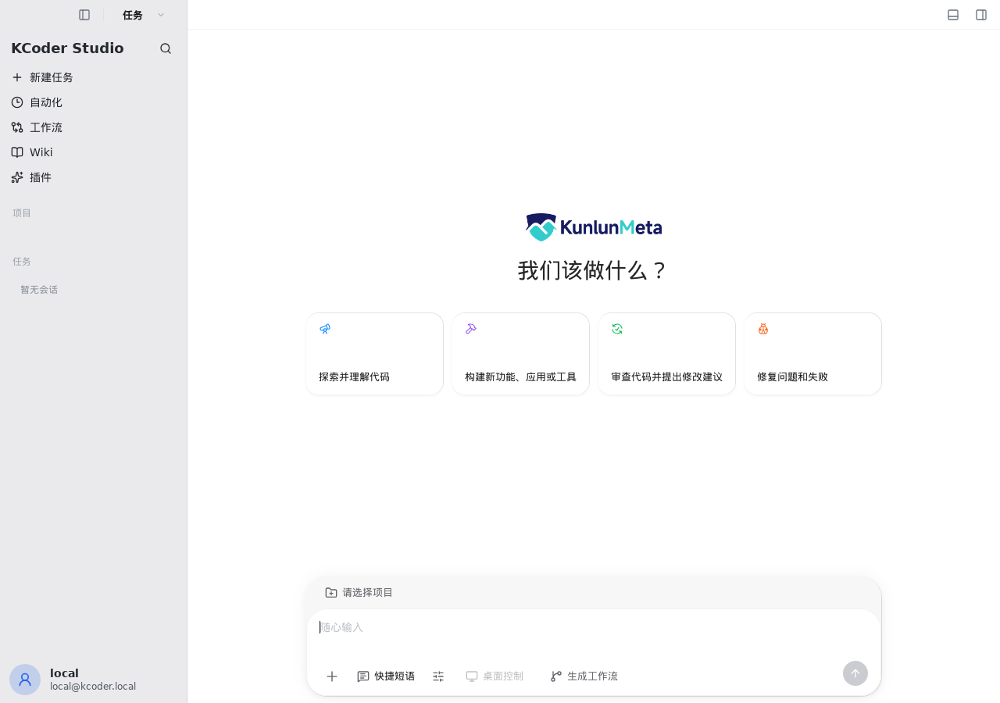
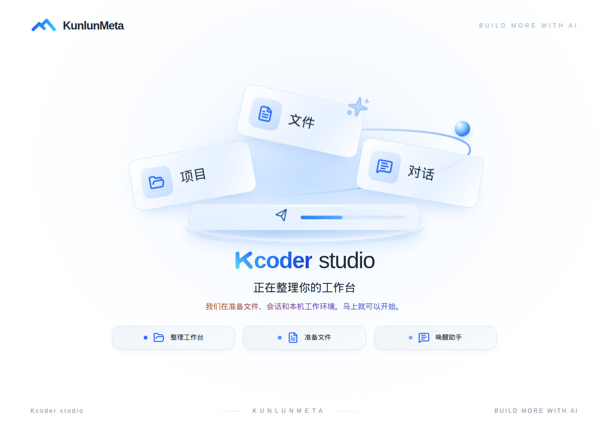
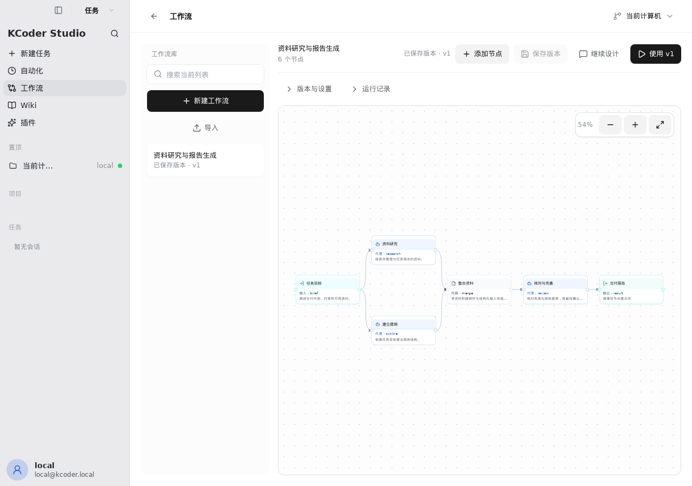
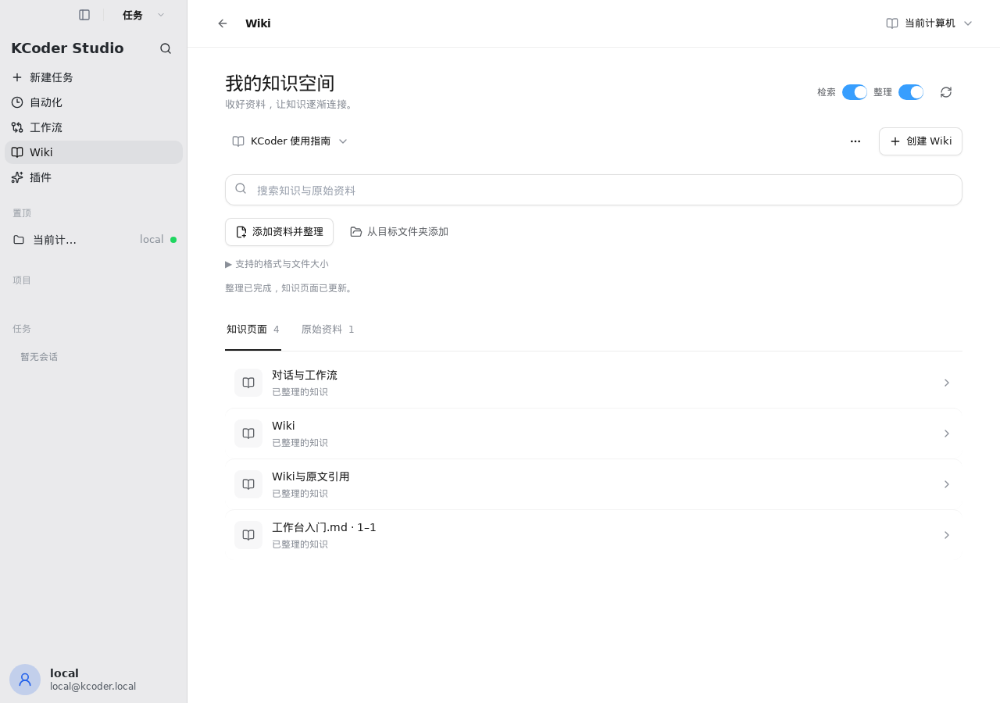
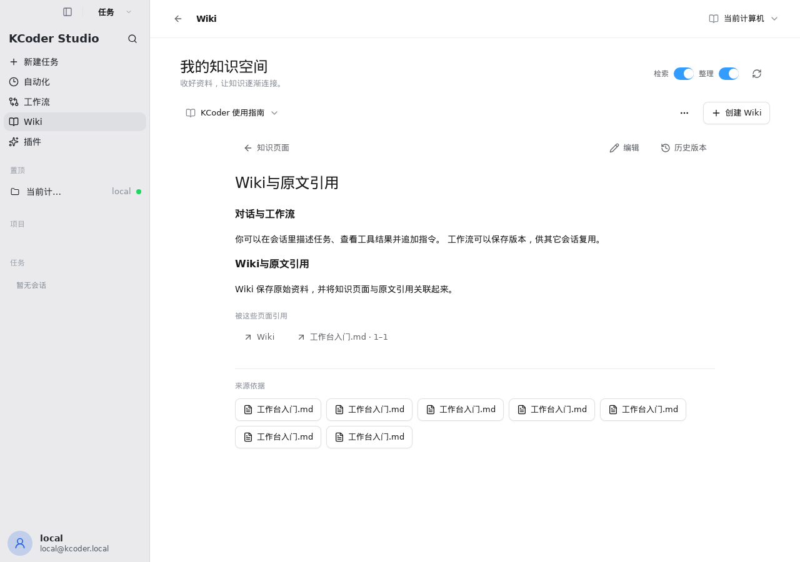
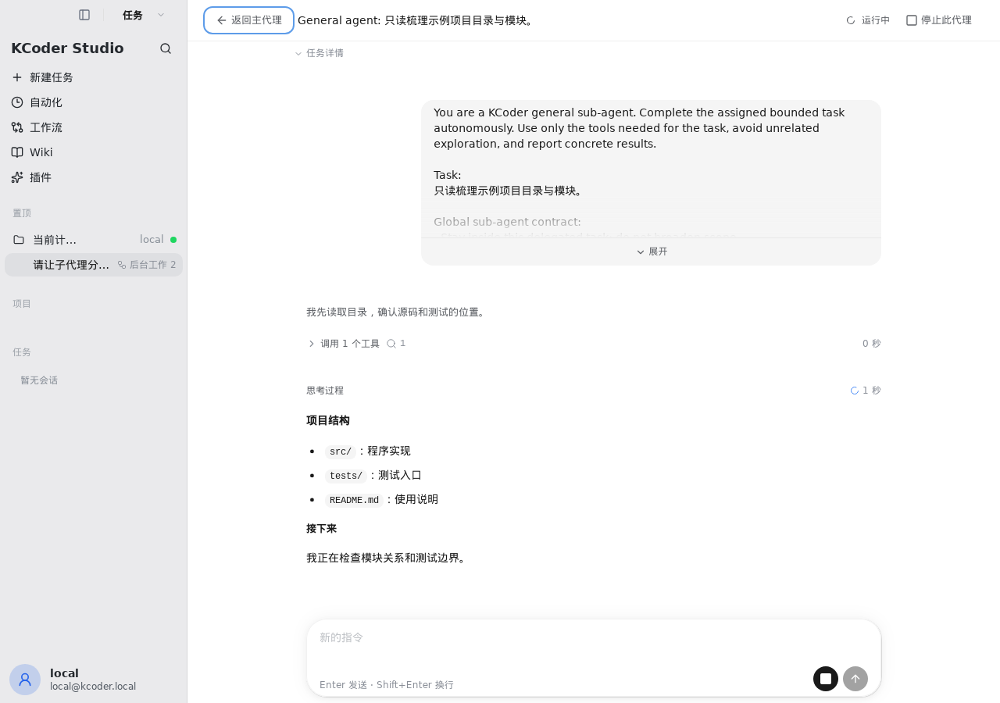
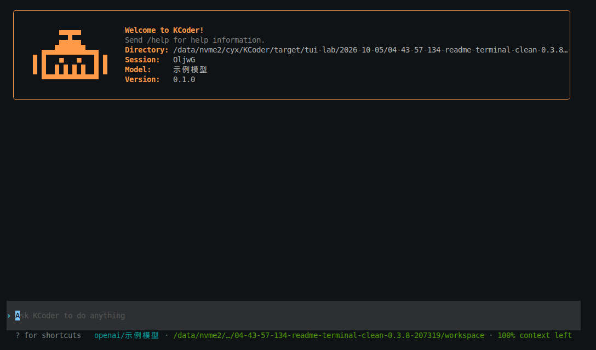

# KCoder

KCoder is an AI workbench built by **KunlunMeta Artificial Intelligence Technology (Shanghai) Co., Ltd.** Use it to work with code and files, operate Windows applications, build reusable workflows, and organize a personal Wiki. **KCoder Studio** provides the visual interface; **KCoder TUI** brings the same agent runtime to the terminal. Both support configurable model providers, tools, Skills, plugins, and persistent conversations.

[Download Studio](https://github.com/KunlunMeta-dev/Kcoder/releases/latest) · [Source](https://github.com/KunlunMeta-dev/Kcoder) · [Report an issue](https://github.com/KunlunMeta-dev/Kcoder/issues)

> This README describes Studio **0.3.39**. It includes recoverable workflows and Wiki organization, local/SSH file upload, selectable plugins and Skills, streamed sub-agent conversations, and 256K output defaults.
>
> Recent improvements cover account isolation, storage recovery, bounded text-save validation, document previews, and recoverable settings editors. Plugin artwork and proxy settings recover after failures. Compact plugin pages use an overlay navigation menu, preserve wide-window sidebar preferences, and keep installation paths in expandable details. File uploads can explicitly retry the unconfirmed remainder of a failed batch, preserving confirmed counts and the original destination.
>
> TUI wheel scrolling moves three display rows per received event in the conversation and copy views. Consecutive events preserve their movement independently of paint timing, and ordinary history scrolling resumes from the row actually displayed. Long history windows record the heights of rendered messages and retain the current message and its local row when the window changes, including Markdown tables and wrapped text. The context footer shows used tokens and its input budget, with finer percentages near 100%; an unknown window is not shown as fully available. Built-in Studio slash-command descriptions, groups and menu feedback follow the selected Chinese or English interface language.
>
> Wiki results still depend on model reliability. Remote capabilities depend on the target build; CLI and Studio versions are independent. See [Releases](https://github.com/KunlunMeta-dev/Kcoder/releases) for individual changes.

Studio 0.3.39 updates individual tool `+/-` counts as real argument fragments arrive, including short writes and patches, and preserves progress through longer conversations. Wiki knowledge pages and original sources now show 10 entries per page and retain separate tab positions. Ordinary progress text stays between activity groups, while the total file-change summary appears after the response finishes. The compact activity area's draggable scrollbar, recoverable workflow/Wiki execution, and local/SSH workspace support remain available.

Studio's General settings offer a compact activity area for newly created conversations. Thinking and tool calls share a scrollable region with a visible draggable scrollbar; ordinary progress text and final replies remain outside. Each group follows its own lifecycle and collapses when finished. Individual writing tools retain live `+/-` feedback during preparation and execution, using separate execution baselines; only the workspace file-change summary waits until the response finishes. Non-Git projects are supported; available file review and recovery actions depend on the selected target.

## What you can do

| Capability | Start here |
| --- | --- |
| Work with code, files, and terminal commands | Create a Studio task or run `kcoder` in a project directory |
| Use a remote Linux server from Windows | Add an SSH target in Studio and select its workspace |
| Build and reuse multi-step automation | Describe a workflow in **Workflows**, save a version, then run it in a conversation |
| Organize documents into a personal knowledge base | Open **Wiki**, name a library, and enable organization, retrieval, or both |
| Operate Windows desktop applications | Enable **Desktop control** for the conversation, then describe the task |
| Extend the agent | Select a catalog on **Plugins**, inspect a plugin, and install it |
| Run long or parallel tasks | Use sub-agents, background commands, `/goal`, and saved workflows |

## Quick start

### Windows Studio

1. Download `KCoder-Studio-Setup-<version>-win-x64.exe` from [Releases](https://github.com/KunlunMeta-dev/Kcoder/releases/latest) and install it.
2. Open **Settings → Models**. Configure a provider endpoint, protocol, model, and API key. Studio accepts the key directly and stores it separately from public model settings.
3. Select **Current computer** or add an **SSH target**, then choose a project directory.
4. Create a task and describe what you want done. Review tool approval requests according to the selected permission mode.

The Windows installer includes the local CLI, Electron desktop host, Gateway, renderer, and packaged supporting resources. Public release attachments currently contain the Windows installer; the macOS Intel DMG will be added after the native build completes. Checksum records and resource manifests are kept with build evidence, not published as extra attachments. Release notes identify the changes included in each installer.

For remote work, configure the model and credentials on the selected target. A Windows provider configuration is not automatically the configuration of an SSH server.

### macOS Intel Studio

macOS packaging is implemented, but a DMG has not yet been published. The target artifact is `KCoder-Studio-<version>-mac-x64.dmg` for an **Intel Mac running macOS 15.7 or later**. Open the DMG and copy KCoder Studio to Applications, then configure the model in **Settings → Models**. The build bundles the local CLI, Gateway, renderer, Chrome for Testing and PDF text extraction resources. Signing and notarization are not configured; macOS may require explicit approval to open it. Apple Silicon packaging and Windows Computer Use are not included in this macOS build.

### Terminal installation from source

Prepare Rust **1.95** or a compatible newer toolchain as required by the workspace. Linux builds also need the Secret Service development library, for example `libdbus-1-dev` on Debian/Ubuntu.

```bash
git clone https://github.com/KunlunMeta-dev/Kcoder.git
cd Kcoder
scripts/install/installers/cli-release.sh
export PATH="$HOME/.local/bin:$PATH"
kcoder --version
kcoder config init
kcoder auth login --provider kunlunmeta
cd /path/to/project
kcoder
```

Configure your actual endpoint and model before using the bundled `kunlunmeta` provider; its local default endpoint is not a hosted service entitlement. You can instead add your own provider as described below.

Windows PowerShell source installation:

```powershell
git clone https://github.com/KunlunMeta-dev/Kcoder.git
Set-Location Kcoder
.\scripts\install\installers\cli-release.ps1
$env:Path += ";$env:LOCALAPPDATA\Programs\KCoder\bin"
kcoder.exe --version
```

These installers build from the checkout. They do not import repository credentials or download a prebuilt CLI from a GitHub release. Existing user configuration is retained. The system-wide Linux entry `scripts/install/installers/cli-release-server.sh` updates `/usr/local/bin`; it requires root. Uninstall scripts preserve configuration and conversation history.

### First terminal session

```bash
kcoder config path
kcoder auth status
kcoder doctor
kcoder "summarize this repository"
```

`kcoder --help` is a read-only probe. For non-interactive use, inspect `kcoder --help` for the current print/output flags instead of driving the TUI through stdin.

## Screenshots

Current Studio 0.3.8 interfaces, captured with isolated sample data. CLI and Studio use independent version numbers.

**Your workspace**



**Startup** — rendered from the current production startup components.



**Reusable workflows** — a saved sample definition with parallel branches and a code node.



**Personal Wiki** — knowledge pages and original material in one place.



**Read with sources**



**Sub-agent conversations** — the ordinary chat layout with streamed text, tool activity, an instruction composer and a return-to-parent control.



**Terminal** — the current CLI in a real PTY rendered by xterm.



## Studio: local, remote, and mobile

Studio provides conversations, model settings, project/file browsing, terminal and change views, workflows, Wiki, plugins, automation, and usage views. The renderer supports Chinese/English, appearance and font preferences, and responsive layouts. Workflow-library and conversation-canvas dividers can be dragged horizontally; narrow layouts keep the conversation usable without requiring a full-width canvas.

The workspace file panel's **Upload files** button sends selected files to the current folder on the execution target, including Linux targets connected over SSH. Multiple files are supported, with progress and cancellation; each file may be up to 100 MiB. Existing files require an explicit **Overwrite** or **Cancel upload** choice. Overwriting rechecks the destination revision, and completed uploads appear in the file tree. Update the target KCoder when Studio reports that workspace uploads are unavailable.

| Entry point | Support and delivery |
| --- | --- |
| Windows desktop | Published Electron installer with a bundled local runtime |
| Linux desktop | Source/build tooling, including an Electron AppImage target; not a current public release attachment |
| Studio Web | Renderer served by a deployed Gateway; the browser does not itself run the Rust agent |
| Mobile Web | Mobile-oriented client connected to the Gateway, including compact/collapsible output |
| Android / iOS | Expo native client source; this is not a claim of App Store/Play Store distribution or complete physical-device certification |
| Tauri | Separate development and compatibility host; not the standard Windows installer |

### SSH targets and accounts

SSH selects the execution machine. That machine owns the workspace, model configuration, plugins, workflows, and Wiki processing. In a remote target, `127.0.0.1` refers to the **server**, not the Windows client.

For a shared server, enable **Require KCoder account login** on the remote target and use separate KCoder accounts. Studio supports signing in, signing out, and switching accounts. Separate accounts isolate application sessions and account-owned data even when users share an SSH transport identity. A shared compatibility-mode `local` profile is not multi-user isolation. KCoder account separation does not remove an SSH root user's host administration powers.

Administrators deploy the account gateway with `scripts/install/installers/studio-account-gateway.py` and manage identities with `studio-account.py`. The account utility prompts for passwords rather than putting them in command arguments:

```bash
python3 scripts/install/installers/studio-account.py create --username alice --role user
python3 scripts/install/installers/studio-account.py list
python3 scripts/install/installers/studio-account.py export --output /secure/accounts.json
```

The corresponding `import --input /secure/accounts.json` migrates identities; it is not conversation or Wiki migration. Preserve the exported identity file as private administrative data.

### Starting Studio from source

```bash
scripts/install/installers/studio-client.sh
kcoder-studio --dev
```

The direct Electron launch uses a loopback Gateway and does not require systemd. Managed Linux launchers are also available:

```bash
scripts/launch/kcoder-studio-web-dev.sh
scripts/launch/kcoder-studio-web-release.sh
```

Their service settings live under `~/.config/kcoder-studio/`. Managed defaults are Gateway `127.0.0.1:4173`, Studio Web `:4174`, Mobile Web `:4175`, and a loopback Expo bundler on `14175`. Network-facing Gateway deployments require authentication; configure the reverse proxy/TLS and access boundaries before sharing an endpoint. Do not treat a LAN address as an authentication mechanism.

## Models, credentials, and tool availability

Studio’s model editor keeps connection, model and API-key fields visible. Expand **Advanced model settings** for context/output limits, capabilities, reasoning and **per-model extra request bodies**; configuration templates and effective runtime details have their own disclosure. Supported protocol adapters include Anthropic Messages, OpenAI Chat Completions, OpenAI Responses, and Gemini GenerateContent. Provider IDs are configuration identities, not a restriction to that vendor's hosted endpoint.

An example user configuration:

```json
{
  "active_provider": "my-provider",
  "tools": { "profile": "full" },
  "providers": {
    "my-provider": {
      "api_format": "openai_chat_completions",
      "endpoint": "https://api.example.com/v1",
      "default_model": "my-model",
      "models": {
        "my-model": {
          "context_window_tokens": 128000,
          "max_output_tokens": 8192,
          "capabilities": {
            "text": true,
            "tools": true,
            "vision": false,
            "reasoning": false,
            "structured_output": false
          },
          "extra_body": {}
        }
      }
    }
  }
}
```

Use the provider's actual supported limits and capabilities. A large configured context window cannot increase the model's real capacity. Marking a model as reasoning-capable does not by itself enable a vendor-specific thinking mode: configure the matching request fields supported by that endpoint.

`providers.<id>.models.<model>.extra_body` applies to one model. When absent it inherits the provider-level body; an explicit `{}` clears that inheritance. Reserved protocol fields are validated. This lets different models use different thinking/budget options without changing the entire provider.

API keys belong in the separate credential store, not in committed settings or extra request bodies:

```bash
kcoder auth login --provider my-provider
kcoder auth import --env-file /private/provider.env
kcoder auth status
kcoder auth logout --provider my-provider
```

The provider ID must match the credential slot exactly. Studio's API-key input uses the credential path too. The application does not automatically read an arbitrary project's `.env` as model credentials.

`tools.profile` explicitly selects `full`, `core`, `nano`, or `none`; it is not chosen from whether an endpoint looks like an intranet address. Tool availability additionally depends on platform, permissions, feature configuration, installed extensions, and session mode. A skill is guidance loaded by the model, not a replacement for an unavailable tool. Changing `tui.alternate_screen` changes terminal presentation only.

Built-in counts have two distinct scopes. The Tools crate's base `full` registry contains **64 tools**, including one platform shell. The ordinary CLI/app-server adds `Config`: **65 registered tools with Wiki off**, **66 with only Wiki retrieval or organization enabled**, and **67 with both enabled**. The corresponding CLI counts are **28–30 for core**, **11–13 for nano**, and **0 for none**. These counts exclude MCP/plugin/desktop contributions and role-specific additions. Goal, permission, file-edit-surface and role filters can reduce the tools sent to a model; use the actual thread's catalog and captured request snapshot rather than treating 67 as a universal count. Source: `crates/kcoder_tools/src/lib.rs` and `crates/kcoder_cli/src/startup/runtime_wiring.rs`.

On supporting source builds, Studio model details and TUI `/model info` distinguish next-turn configuration from an admitted turn's frozen snapshot. Inspect the effective output limit and its source when a configured model limit seems ignored. Tool details distinguish the configured profile, the actual session/Agent registry count, and tools exposed in a captured request. Unknown counts remain unknown; model tool capability is not a tool count. Workflow Agent records and Wiki worker details retain their own execution snapshots rather than substituting today's settings.

### Configuration layers

Later layers override earlier values; nested objects merge while arrays are replaced:

1. Bundled defaults.
2. User `~/.config/kcoder/settings.json`.
3. Settings beside the executable.
4. Project `.kcoder/settings.json`.
5. Personal project `.kcoder/settings.local.json`.
6. Explicit `--settings-file` overlays, environment variables, and CLI arguments.

JSONC comments and trailing commas are supported. A matching `settings.schema.jsonc` is installed beside user settings for editor completion. Explicit provider declarations control which providers remain configured; deleted defaults are not silently re-added.

```bash
kcoder config list --sources
kcoder config get active_provider --source
kcoder config set tools.profile full --scope user
kcoder config validate
```

`KCODER_CONFIG_DIR` overrides the configuration directory. Debug launchers can use a separate dev profile: check `kcoder config path`, binary path, and `kcoder --version` when installed and source builds behave differently.

## Workflows: create, save, reuse, and recover

Open **Workflows**, choose the target and workspace, and describe the task in the design conversation. Nodes appear progressively on the canvas. Continue the conversation to modify an existing definition, or edit nodes directly. The canvas supports selection, dependencies, dragging, zoom, and fit-to-view; its library and conversation dividers are resizable.

**Generating or editing a definition does not execute its nodes.** Save publishes a validated immutable version. Use that version in a new conversation or choose **Reuse workflow** from another conversation on the same target/account. Editing the draft does not change an already saved version or an existing run.

During generation, KCoder checks graph structure, node contracts and local logic. After generation it asks whether to run execution verification. Testing starts only after an explicit request; an initial request to generate and test already supplies that consent. Authorized verification checks outputs and artifacts against the agreed criteria and iterates corrections. Agent nodes default to 60 turns; explicit per-node limits are retained.

### Node types

| Node | Purpose |
| --- | --- |
| Agent | Model-driven work with the execution session's allowed capabilities |
| Input | Read workflow input data |
| Code | Bounded pure JavaScript calculations; no shell, filesystem, network, or model access |
| Transform | Map, filter, sort, deduplicate, and limit arrays |
| Tool | Invoke a registered session tool through normal permissions and Hooks |
| Template | Select/format the supported data representation; use the node contract, not assumed arbitrary template syntax |
| Condition / Switch | Evaluate predicates or select cases; use dependencies and `runIf` to gate downstream execution |
| Merge | Join branches under the selected merge policy |
| Loop | Repeat or iterate over items, optionally using a saved subworkflow body |
| Subworkflow | Call a fixed saved definition/version |
| Wait | Persist a deadline and wait until it is reached |
| Human | Wait for a schema-validated user reply |
| Event | Wait for an explicitly submitted named event, not an automatic external-service subscription |
| Output | Produce the final workflow output |

Independent nodes can run concurrently. Dependencies pass structured data. Agent/tool nodes remain subject to session permissions and execution limits; Code nodes cannot bypass those limits by invoking system commands. Human and Event nodes intentionally pause until the required input arrives.

Definitions are bounded to 64 nodes and 128 KiB. The account library retains saved versions instead of silently pruning them. Workflow schemas and node contracts validate inputs, references, output shape, and optional pure-JavaScript `resultCheck` assertions. A successful graph run is not proof that a file was correctly produced or an external action succeeded: check the actual result. Choose reachable loop thresholds and assert required fields rather than treating missing data or error objects as success.

### Failure recovery

Prefer **resuming the existing run** after addressing its failure cause. In Studio, ask: “Resume the failed workflow and reuse completed results.” In TUI:

```text
/workflow status <run-id>
/workflow requests <run-id>
/workflow respond <run-id> <request-id> <json>
/workflow resume <run-id>
```

Resume keeps the run ID, saved definition/version, and input checkpoint, reusing eligible completed outputs while retrying unfinished work. The canvas follows the resumed attempt's progress. This is not instruction-level continuation or an exactly-once guarantee for external actions; check unknown effects before repeating them. A rejected start with no run ID cannot be resumed. After saving a changed definition, choose **Continue with the new version** from its run history, or ask for `Workflow({definition_id, version, reuse_from_run})` in the original execution conversation. This creates a new run and preserves the old history. New-format successful node checkpoints are reused only when the node’s execution semantics, every upstream dependency, inputs, model and permissions still match; changed nodes and their affected descendants rerun. Canvas position, display titles and list order do not invalidate a checkpoint. Old runs without these checkpoints report that cross-version reuse is unavailable rather than silently starting over.

### Structured arguments and editing

The `Workflow` tool accepts saved definitions as well as legacy inline JavaScript and `.kcoder/workflows/<name>.js`. Prefer `args_json` when an endpoint does not reliably preserve nested JSON types. For a script that reads `args.items`, pass an object containing `items`, not a bare array:

```json
{ "definition_id": "<id>", "version": 1, "args_json": "{\"items\":[\"1\",\"2\",\"3\"]}" }
```

`args` and `args_json` are mutually exclusive. Definition editing similarly supports JSON-text alternatives such as `input_schema_json`, `node_json`, and `nodes_json`. Type errors are reported rather than guessed away. Draft edits use revision checks; layout-only saves do not advance the content revision on supporting targets.

Conversations created by scheduled tasks appear in the sidebar automatically. Opening one loads its task instruction and saved reply; startup failures and completion also refresh the list without changing the active conversation.

Workflow cards can be dismissed per conversation. `WorkflowDraft.create` validates and saves an optional input contract atomically. Direct graph execution also materializes declared defaults before validation. Scheduled startup failures now report their actual error instead of leaving an apparently running empty conversation; configure a default provider/model for unattended tasks.

`patch_nodes` supports deletion without an accompanying `nodes` array and can clear the current draft. Empty drafts cannot be published; existing saved versions remain intact. For exact file validation, `read(format="raw")` returns complete decoded text and rejects `offset`, `limit`, and `pages`; use numbered mode for slices.

Runtime verification is separate from saving or static graph checks. Generation offers verification for explicit user approval; review the exact saved version, named input/checks and intentional skips before running. Version history and storage actions preserve pinned/active/unknown-effect references. A passed scenario or a user-adjusted run does not establish that the unchanged saved workflow succeeds for every input.

On updated targets, **Manage run history** previews selected completed observations before explicit confirmation. Archival releases the observation quota while retaining execution artifacts, checkpoints, verification evidence and fixed version references. Active runs and unresolved effects block archival; archived observations remain readable.

## Personal Wiki

Wiki organizes original material into linked, cited knowledge pages using the selected target's configured LLM. It does **not require embedding or reranking models**. Search uses local lexical retrieval; original sources remain available for checking the model's interpretation.

Knowledge pages and original sources have separate pagination, with at most 10 items per page. Later directory entries load on demand, while completed organization jobs refresh the current valid page instead of growing the list indefinitely.

1. Open **Wiki** and select the local or SSH target.
2. Create a library and enter a meaningful name.
3. Enable **Organization**, **Retrieval**, or both.
4. Upload files or select files from a target folder; track each import/organization job.
5. Open knowledge pages and citations, or ask a conversation to search your Wiki.

The switches are independent and default off:

```json
{
  "knowledge": {
    "retrieval_enabled": true,
    "organization_enabled": false
  }
}
```

Retrieval-only use exposes reading/search without enabling imports. Organization-only use still reads existing pages as needed to merge material. Disabling organization pauses its jobs and keeps the data; re-enabling it does not silently resume paused jobs. Wiki availability does not mean every conversation will be searched or automatically ingested.

### Supported material

| Input | What is extracted |
| --- | --- |
| TXT / Markdown | Text; UTF-8 or BOM-marked UTF-16 |
| HTML `.html/.htm` | Offline title/body/list/table text and image alt text; no scripts, external resources or rendered layout |
| PDF | Extractable text and page references; scanned pages are not automatically OCRed |
| Word `.docx` | Body paragraphs and tables, without requiring Microsoft Word |
| Excel `.xlsx` | Sheet names, cell coordinates, date/time styles and booleans, stored values and cached formula results; no formula recalculation |
| PowerPoint `.pptx` | Slide text in presentation order, not animations or rendered slides |
| PNG / JPEG / WebP | Native model vision; a vision-capable model is required, and no automatic OCR is used |

Office XML parts support UTF-8 and BOM-marked UTF-16. Legacy `.doc/.xls/.ppt` and encrypted Office files must first be converted to supported unencrypted formats. Office extraction does not promise every embedded image, note, header, or visual layout. Image interpretations are labeled; original images can be previewed and original files downloaded.

Batch upload supports **10 files**, up to **32 MiB per file** and **128 MiB total**. Images have stricter limits: 10 MiB, 8192 pixels per edge, 16 megapixels, and a shortest edge of at least 32 pixels. Extracted text is limited to 8 MiB; oversized extraction is rejected explicitly. Individual failures are reported and retryable without repeating already completed imports. Target-folder import previews immediate files before staging only the selected subset; it does not recursively ingest an entire disk. File-format attachment import is a Studio/app-server flow; TUI `WikiManage` provides text import.

Wiki job rows keep the source, stage and pause/retry action visible; detailed model, token and connection diagnostics open separately. **Retry from checkpoint** retains committed chunks and stored stage artifacts. It rebuilds requests, revalidates matching cached outputs, and retries missing or invalidated work. This is request-cache recovery rather than an independent stage scheduler. Structurally parsed analysis/generation responses and validated stage outputs are cached privately; some later verification responses do not yet have an independent durable stage record. Truncated JSON is never published as a successful result. This reduces repeated calls after failures without claiming that every model produces valid organization.

Current source builds accept common model-response variations: a single complete JSON result inside Markdown fences or explanatory text, trailing commas, known field aliases, a single page instead of a page array, optional empty fields, and unambiguous numeric/boolean strings. Studio 0.3.10 also accepts JSON-encoded result envelopes and common collection wrappers, keeps ordinary warnings separate from blocking review requests, and restores uniquely matching whitespace-only citation variants to the original source bytes before normal evidence checks. Missing prepared suggestions remain resumable instead of opening an empty review. Current source also accepts explicit supplied-chunk line/UTF-8 byte ranges, missing or null source bindings that the host can determine uniquely, matching redundant citation-ref metadata, and uniquely matching HTML character-entity variations. The host fills real evidence from the immutable source; foreign identities, ambiguous spans and different facts still fail verification. The worker supplies redundant source bindings and derives omitted organization placements from the selected immutable evidence before checking source support. The 2,000-character new-topic target is a writing recommendation; complete supported pages may use the existing 1 MiB page allowance. Conflicting fields, truncated results, unknown citations, unsupported claims and stale page revisions still prevent publication. Existing stage caches from the previous response contract remain reusable and are checked with the current parser.

Studio 0.3.9 adds a durable Wiki pipeline. New Wiki jobs persist stage records and complete model responses before parsing. Source analysis and individual topic candidates can be reused after interruption; resume repeats only missing or invalidated work. Edits to a page invalidate candidates that read that revision, while unaffected topics remain reusable. Local and remote workers can run two jobs concurrently; a library-wide automatic merge lease coordinates generation through publication without blocking human edits or weakening final revision checks. Studio shows recorded stages, topic counts and reuse status, with a stage-specific resume action. Legacy jobs retain their previous recovery format.

Updated source builds also persist image imports before native vision processing. They retain the original image, complete interpretation, recorded stages and call usage. Explicitly retrying a failed source commit reuses its complete interpretation after restart without another vision call. An interrupted interpretation with no complete response may require approval for another call; unknown usage stays unknown. Semantic repair invalidates the rejected candidate in both caches so checkpoint recovery does not replay the same failed output.

Wiki uses target model credentials and settings. Its internal output ceiling is **1,048,576 tokens**, capped by a lower configured model limit; that ceiling does not grant a model unsupported output capacity. Model response text is bounded to 4 MiB and a single knowledge page to 1 MiB. A provider length stop triggers one compact-output retry with the same source evidence; repeated truncation retains diagnostic token limits and stops safely. Citation mismatches receive up to two evidence-based repair attempts; unresolved quotes are rejected before publication. New automatic topics use a suggested writing length; complete new or existing pages retain the 1 MiB page limit and their output allowance within the model ceiling. The host preserves the extracted source rather than asking the model to rewrite it. Automatic organization can select host-offered citation-span references; the host expands them to the exact immutable source text before ordinary evidence checks. Public WikiManage page proposals still use literal citations. Unknown references are rejected, and selecting a reference does not prove the surrounding claim. A bounded source-support check covers changed content and applicable scope; unsupported, uncertain or insufficiently organized candidates require review. Normal source-support verification counts against the real global model-call budget independently of the three-repair allowance; its model judgment can still be wrong. New automatic workers also bind a purpose agenda to the current source revision and map required source units to actual topic-page lines and citations. Missing coverage permits at most one complement, followed by support verification, only when the relevant repair and global model-call budgets permit the calls. Otherwise the candidate remains private for review. Validated intermediate results are cached for resume; already recorded calls are not repeated. Organization metadata can receive one bounded correction per plan or proof within that same shared allowance. The host derives redundant links and explicitly selected whole-page ranges; it does not invent relevance decisions or approve missing facts. Unresolved candidates remain private with review notes, rather than an empty review entry. Dense paragraphs or table rows are checked in complete adjacent ranges when needed, retaining original context and every constituent claim. Wiki keeps the entire requested purpose, including formatting and negative constraints. Authors, dates and version labels also need evidence in the supplied extracts or retained citations; familiar document metadata is not automatically trusted. Source-only output or a model vote of “complete” does not establish organized coverage. Jobs report truncation and processing errors. On supported Unix account/SSH targets, target-side organization workers can survive a client disconnect; local desktop jobs remain tied to their app-server process and may need resuming after interruption.

Pages support editing, revision inspection/restoration, and review of generated changes. Human-edited content is not silently replaced. Libraries support archive/restore, index rebuild, and `.kwiki` export/import. New targets transfer collections up to 1 GiB with parts of at most 96 MiB; retain the manifest and every part. Older targets keep their 64 MiB JSON backup limit. Imports verify the complete collection before publishing; cancelling or supplying corrupt/missing parts preserves the library. Archives carry sources and page history, not credentials, account identities, or running jobs. Remote Wiki data belongs to the selected account on the server.

In TUI, `/wiki` (alias `/knowledge`) reports availability. `/wiki on` and `/wiki off` request changing both switches through configuration; use individual keys to change just one. `Wiki` provides reading/search, while `WikiManage` handles explicit maintenance tasks. Source reads use the revision returned by the source listing rather than guessing it.

Model output defaults are **256K (262,144 tokens)** for new Studio models, ordinary conversations, Wiki stages, summaries, memory writers and MoA. Explicit model limits and available context still determine the admitted request. A small context window clips an inherited default; existing explicit limits are retained. The configurable allowance does not certify a provider supports that output size.

Optional Provider/model `response_limits` bound local decoded response memory independently: 64 MiB total UTF-8 output, 16 MiB arguments per tool call, 1024 content blocks and 64 simultaneously open calls by default. Model fields inherit unspecified Provider fields. A limit violation discards the response and executes none of its pending tools; it does not reduce the 256K token allowance. See the bundled [settings guide](crates/kcoder_skills/src/assets/builtin/kcoder-settings/references/providers.md#local-response-memory-limits) for validation and scope.

Binary previews pin an opaque revision on capable execution targets and stop if a later chunk comes from a changed file, including ordinary same-size writes with restored modification timestamps. Older targets retain metadata checks; they do not provide the stronger revision guarantee. TUI instances merge their new input-history entries under a cross-process lock instead of overwriting another instance’s commands.

## Windows Computer Use

The Windows Studio package includes a desktop-control component and the `windows-computer-use` skill. Enable **Desktop control** for the current conversation before asking it to operate applications. The authorization applies to that conversation and can be revoked in Studio.

Computer Use is not screenshot-only automation:

- **Snapshot** reads accessible windows/controls through Windows UI Automation, without OCR.
- **Screenshot** supplies visual evidence to the model's native vision. Establish a full view first; a deliberate region capture can inspect details afterwards.
- **App, Click, Type, Scroll, Move, Shortcut, and WaitFor** interact with windows, native input, and supported wait conditions.

The model should scroll the relevant pane to discover content outside the viewport, confirm focus before typing, and verify effects. An installed skill alone does not create desktop tools: the host component and conversation authorization must both be available. Tools work with Anthropic- or OpenAI-format models when the selected adapter/model supports the necessary tool and image capabilities.

Ordinary file operations, process inspection, background scripts, and service administration use normal file/Shell/PowerShell permissions and do not require desktop authorization. Conversely, GUI automation must not bypass a revoked desktop lease by substituting shell-based input injection.

Desktop control targets the authorized Windows desktop, not the filesystem of an SSH target. If a channel fails after an input action, the action may already have happened. On supporting source builds, use Studio's host-owned recovery control when it is available; after recovery, obtain a fresh full Screenshot or meaningful full Snapshot before sending input. Check the resulting UI before deciding whether an uncertain prior action needs repeating. Authorization, channel readiness, and cleanup are separate facts; waiting alone cannot restore a retired channel.

## Inspect and adjust sub-agents

Click an agent in the conversation list or a workflow node to open its conversation. Public messages use the same Markdown and tool-output components as ordinary chat; the shared composer supports Enter to send and Shift+Enter for a new line. **Return to main agent** restores the parent conversation without stopping the worker. Parent and child drafts remain separate; task identities and technical details are collapsed by default. Send a targeted adjustment at a safe execution boundary; use the original command ID to query an uncertain delivery. Applied means received by the worker, not completion of the requested change. Independent stop and source-bound questions appear only when the actual target supports them. Mobile uses an overlay with collapsed output and keeps unknown query IDs without saving command bodies.

Targets advertising `agentConversationStreamV1` send an atomic initial conversation snapshot followed by incremental assistant text, tool activity and recorded results, using the ordinary chat reducer and layout. Opening or reopening a child does not wait for its final answer. Sequence gaps or connection loss trigger a fresh subscription while retaining displayed content and unsent instructions. Closing the view releases observation without stopping the agent; completion settles its activity indicators. Older targets offer clearly identified read-only history rather than simulated streaming. Raw command stdout is shown when its tool result is recorded; the engine does not currently emit separate stdout chunks.

## Plugins and marketplaces

On **Plugins**, select a marketplace from the dropdown, browse/search its catalog, inspect the requested plugin, and install it. Adding a catalog does not install every item or authorize third-party accounts.

**New in 0.3.0:** Studio retains the selected marketplace when you leave this page and return during the same app session. Compatibility now covers additional skill layouts, root plugin manifests, named resources, and archive filename variants. Known unavailable plugins are marked before installation with disabled install buttons and explicit reasons. Plugin details explain missing credentials or inactive components; successful installation does not mean a third-party service is already authorized.

Plugins blocked only by missing credentials offer **Install with KCoder**. This opens a fresh conversation draft on the selected execution target with the plugin identity, marketplace address/path, source revision and missing configuration. Send the prepared request to receive step-by-step installation guidance. Credentials should be entered in the plugin-detail private form on that target; missing declared values are saved with exact source/operation validation and cannot overwrite another concurrent submission. Ordinary next turns refresh the affected MCP server while retries and running agents retain their snapshot. Choose an existing conversation to check actual tools, Skills and Hook facts; installation and service authorization are verified separately. Package integrity failures and unsupported packages remain blocked.

| Preset | Source |
| --- | --- |
| Claude official | `anthropics/claude-plugins-official` on GitHub |
| OpenAI | `openai/plugins` on GitHub |
| xAI / Grok | `xai-org/plugin-marketplace` on GitHub |
| Tencent CodeBuddy | `cnb.cool/codebuddy/marketplace` |
| WorkBuddy official / Teams | Two separate public catalogs on `download.codebuddy.cn` |
| Alibaba Qoder | `qoder.com/marketplace` |
| TRAE Code / Work China | Domestic official `trae-remote-official` registry |
| Anthropic Skills | `anthropics/skills` on GitHub |
| Superpowers | Community `obra/superpowers-marketplace` on GitHub |

These presets use public catalog/download sources. **Kimi Work is excluded** because its catalog requires additional authorization. Private or login-only items in a vendor's own client are not implied to be included. Custom Git repositories and local marketplace files/directories remain supported.

Original plugin artwork is shown when the source supplies usable icons; missing artwork uses a fallback. Installing a plugin and activating every vendor-specific feature are different operations. Inspect component compatibility, dependencies, required service credentials, and failure details.

### Compatibility

KCoder recognizes KCoder/Agent Plugins and `.claude-plugin`, `.codex-plugin`, `.cursor-plugin`, `.grok-plugin`, `.codebuddy-plugin`, `.qoder-plugin`, and `.trae-plugin` layouts. Local, Git, npm, bundled, and supported hosted ZIP sources enter the managed plugin store through bounded staging and atomic updates. Hosted adapters validate package identity and available published checksums; a locally computed digest is not a publisher signature.

| Contribution | Behavior |
| --- | --- |
| Skills | Discovered and loaded as named guidance/resources |
| MCP | Registered through KCoder's MCP client; service credentials may still be required |
| Command Hooks | Executed through supported lifecycle hooks and trust rules |
| Markdown commands and agents | **New in 0.2.26:** exposed as namespaced skill launchers that invoke real KCoder sub-agents |
| Vendor Apps/connectors and host-managed binaries | Require dedicated integration; catalog presence is not executable support |

**New in 0.2.26:** Markdown agent launchers inherit the current model and parent permission policy. Agent `tools` can narrow the available tool set; turn caps and tool restrictions persist across continuation. Command `allowed-tools` metadata is not imported as authorization. Parameters support positional/named arguments and supported plugin-root context substitutions. Dynamic `!` shell injection, per-agent Hooks/permission/memory overrides, and unsupported tool-rule syntax produce compatibility diagnostics rather than being silently activated.

This expands installability of command/agent-heavy catalogs; it does **not** mean every plugin or external service has been tested end-to-end. Namespaced Skills avoid collisions. Start a new conversation after changing installed plugins when the current conversation holds an earlier plugin generation.

### Proxy discovery and installation diagnostics

Downloads and proxy checks run on the **selected target**. Its loopback address is not the desktop client's loopback address when using SSH. Set a manual installation proxy or enable automatic detection on the Plugins page.

**New in 0.2.26:** automatic discovery enumerates the host's TCP listening addresses/ports instead of relying on a fixed list. It probes proxy protocols in bounded batches, then verifies actual HTTPS access sequentially until it finds a usable candidate. An open socket or successful CONNECT response alone is insufficient. No fixed proxy port is required or preferred. Manual settings remain available and are preserved when automatic detection is disabled.

**New in 0.2.27:** Qoder packages support both official download buckets and discovery of a unique manifest when metadata omits its path. TRAE packages support numeric distribution namespaces, including `1` and `1001`, while retaining plugin identity, version, size, and checksum validation.

**New in 0.2.26:** install failures are visible on the affected card, with details, rather than only appearing above the catalog. Proxy, network, archive, manifest, compatibility, missing dependency, and service authorization problems require different remedies. A repeatedly failing plugin should be diagnosed from its actual message rather than retried blindly.

Useful terminal commands:

```bash
kcoder plugin list --all
kcoder plugin read <plugin-name@marketplace> --json
kcoder plugin doctor <plugin-name@marketplace>
kcoder plugin install --path /absolute/path/to/plugin
kcoder plugin disable <plugin-name@marketplace>
kcoder plugin uninstall <plugin-name@marketplace>
kcoder marketplace list --json
kcoder marketplace refresh <marketplace>
```

Project extensions and local catalogs respect directory trust. User-level and managed-store sources are handled separately. Installing a catalog must not broaden trust to unrelated directories.

## Skills, MCP, and agent tools

Skills are instructions and resources, not independently running tools. Available Skills are described to the model; a task or explicit skill selection triggers loading the relevant guidance. In Studio, `$` opens skill selection. The built-in `kcoder-settings` skill explains configuration, models, plugins, and runtime behavior. Other bundled skills cover workflow authoring and Windows desktop interaction.

In Studio, **Plugins → Manage → Skills** enables or disables a named Skill for the selected target account across its projects. New conversations use the saved setting; disabling retains installed files and plugin ownership, and does not erase Skill content already loaded into a conversation.

Skill entries are bounded to 1 MiB. Their flat Markdown references load in filename order with 1 MiB per reference, 8 MiB total, 128 Markdown files and 10,000 inspected directory entries. Bad UTF-8, unreadable files, symlink resources or non-regular Markdown entries reject the complete Skill; the runtime does not activate a partial constraint set. No recursive reference scan is implied.

MCP adds callable external tools. Supported transports are stdio, legacy SSE, and Streamable HTTP. Configure servers under `mcp_servers` or through the supported Studio plugin/MCP flow. Project-level servers obey trust rules; servers needing credentials remain unavailable until configured or authorized. Use the actual tools attached to the conversation and their current schemas to establish what the model can call; registry presence alone does not grant permission to execute them.

Built-in tools cover file read/edit/write, bounded glob/grep search, shell execution, web retrieval, tasks, sub-agents, workflows, Wiki, and configuration. Tool permissions and limits remain active in TUI and Studio. `WebBrowser` text snapshots and `WebFetch` are not visual screenshots or a substitute for desktop control.

`glob` scans files, not directories. Top-level/home/drive-root searches require narrowing the path or explicitly selecting an expanded scan budget and a positive result limit. `grep` searches content; its context and output limits are not directory traversal controls. Text tools support explicit encoding handling for legacy Windows files; use an appropriate encoding rather than writing corrupted decoded text back to disk.

## Conversations and long tasks

Conversations retain messages, tool outcomes, and recovery state. Studio provides history and archived tasks; TUI provides session selection and export/import commands. Interrupting a turn should settle pending tool presentation, while a retried model request or resumed workflow has its own recovery semantics.

| TUI entry | Purpose |
| --- | --- |
| `/help` | Current command help |
| `/model` | Select configured provider/model |
| `/resume` | Resume an existing KCoder conversation |
| `/export` / `/import <path>` | KCoder snapshot export/import |
| `/compact` | Request context compaction |
| `/plugins` | Inspect plugins |
| `/wiki` | Wiki status and availability |
| `/workflow` | Workflow status, requests, and recovery |
| `/goal` | Explicit long-running objective |
| `/goal-pro` | Objective with independent completion verification |
| `/spec` | Spec-driven development lifecycle |
| `/memories status` | Inspect structured long-term memory |

**External history boundary:** `/import` currently reads a KCoder JSON snapshot. It is not an implemented Codex/Claude Code history browser or a promise to translate their tool traces. External-history import has a design plan; do not point `/import` at arbitrary files from `.codex` or `.claude` and assume compatibility.

Sub-agents can explore or perform bounded work under their assigned role and tools. Background shell tasks and background agents have separate output/status mechanisms. Goal continuation, scheduled tasks, and workflows build on the same runtime but have distinct lifecycle controls; use the relevant status and stop operation.

Context management includes tool-result trimming, placeholders, and model-assisted summaries. These have separate budgets and thresholds. Replacing older tool results is not the same operation as summarizing the entire conversation. Structured memory and Wiki also serve different roles: memory retains reusable agent knowledge; Wiki exposes user-organized, cited source collections.

### Automation, goals, and engineering workflows

Studio's **Automation** page provides scheduled-task management. Scheduling uses explicit target/workspace context; a local schedule cannot execute while its required runtime is unavailable. Inspect the schedule and execution status separately from the conversation that created it.

`/goal` starts an explicitly requested long objective with status, pause/resume, and budget controls. `/goal-pro` adds an independent verification gate before accepting completion. Neither a model's final sentence nor a green workflow node should substitute for task-specific evidence.

For spec-driven development, `/spec` manages initialization, change proposals, tasks, validation, review, synchronization, and archival. Authoritative specifications are separate from an in-progress change; publication/archive is a deliberate lifecycle step. The runtime also supports optional TDD guardrails, model aggregation, structured long-term memory, and background execution. Their availability depends on configuration and the session's tool profile.

## Permissions and trust

KCoder applies permission decisions around tool execution, with filesystem/shell controls where supported, project-directory trust, Hook events, and audit records. A permissive/yolo mode deliberately reduces approval prompts; it does not make arbitrary third-party plugins trustworthy. OS-level sandbox guarantees vary by platform and deployment.

Project instructions, Skills, MCP servers, and Hooks are extension surfaces. Review trust and activation rather than assuming that opening a repository authorizes every executable contribution it contains. Project guides are loaded completely as UTF-8, up to 4 MiB each, 16 MiB in total and 128 files; unreadable or oversized constraints stop initialization with an error instead of being silently dropped. The existing current-directory AGENTS.md override and ancestor order are preserved. Windows Computer Use has its own conversation authorization boundary.

## Architecture and source development

The main chain is `kcoder_cli → kcoder_engine → providers/tools/state`, with TUI and app-server as entry/transport layers. Studio's Gateway connects desktop/Web/mobile clients to local or SSH app-server processes using typed JSON-RPC contracts.

| Area | Responsibility |
| --- | --- |
| `kcoder_types`, `kcoder_config`, `kcoder_app_protocol` | Shared types, configuration, and client/server contracts |
| `kcoder_api` | Provider protocols and streaming |
| `kcoder_engine`, `kcoder_state` | Agent orchestration, tool lifecycle, persistence, and recovery |
| `kcoder_tools`, `kcoder_permissions` | Tools, authorization, and execution boundaries |
| `kcoder_plugins`, `kcoder_hooks`, `kcoder_mcp`, `kcoder_skills` | Extension discovery, compatibility, and invocation |
| `kcoder_workflow`, `kcoder_knowledge`, `kcoder_memory`, `kcoder_specs` | Workflows, Wiki, memory, and spec-driven development |
| `kcoder_repl`, `kcoder_cli` | Terminal UI, command entry, and app-server composition |
| `apps/kcoder-studio` | Electron host, React renderer, Gateway, Expo mobile client, and E2E tooling |
| `scripts`, `tools` | Build/install/release tooling and verification harnesses |

Build and focused validation:

```bash
cargo check --workspace
cargo test -p kcoder_plugins
cargo test -p kcoder_workflow
cargo test -p kcoder_knowledge
cargo build --release --bin kcoder
pnpm --dir apps/kcoder-studio/renderer build
git diff --check
```

Use the relevant tests for the change, then broader checks as needed. UI verification includes the real desktop host; renderer tests or a browser screenshot alone do not prove installer behavior. Source builds for other platforms are not published binary support claims.

CI runs independent Studio and Mobile Web frontend gates on pull requests, main/master pushes, nightly runs, and full manual runs. Studio checks TypeScript, ESLint, typography, task lifecycle rules, unit tests, and the production build. Mobile checks the generated terminal WebView, TypeScript, unit tests, and the Web build. Dependencies use frozen lockfiles; test reports are retained for five days.

Other CI gates cover the Rust workspace, shared protocol generation, Skills/Workflow/Wiki and extension contracts, Gateway/Electron and E2E harness tests, multi-Gateway relay routing and isolation, Python desktop/account/deployment helpers, built-in skill scripts, PowerShell syntax and installation rollback, terminal tooling, website behavior, release helpers, resource integrity, and the vendored model SDK. The relay also participates in the project PR/full test matrix. Native Windows/macOS/BSD jobs retain their actual failures; registering a check does not claim that every platform passed.

Nightly/full runs execute the existing browser, terminal, SSH and packaged application matrix. Android native compilation builds the actual unsigned debug application on nightly/full runs and through the `android` dispatch; this checks compilation without claiming device acceptance. Real-model tests use the protected `real-model` dispatch. Real desktop tests use the protected `platform` dispatch; configure `KCODER_PLATFORM_RUNNERS_JSON` as a target-to-self-hosted-labels map and provide the target's owned CLI/Tauri/package paths in `protected-platform-tests`. Missing target configuration fails before scheduling the desktop job. Offline performance benchmarks have a separate `benchmarks` dispatch. iOS native execution remains deferred.

The public repository is a filtered source snapshot. Internal `docs/` and project instruction files are intentionally excluded, while runtime-required skill resources and third-party notices are retained. Use `kcoder --help`, `/help`, and the installed settings schema for the exact interface of your build. A public snapshot commit can differ from the development source identity embedded in an installer.

## Troubleshooting

| Symptom | Check |
| --- | --- |
| Installed app differs from source behavior | Studio version, `kcoder --version`, executable path, and configuration directory |
| Model cannot connect | Provider ID/endpoint/protocol, credential slot, target proxy, and `kcoder doctor` |
| Skill listed but required tool missing | Actual tool profile, platform, plugin activation, session mode, and required authorization |
| Plugin install does not complete | Card details/diagnostics, target network/proxy, manifest and component compatibility |
| Plugin installed but no visible action | Contribution type: a skill/MCP tool is not necessarily a toolbar button; open a new conversation |
| Wiki remains in processing state | Job status/error, model credentials/output limits, organization switch, and whether the target worker was interrupted |
| Workflow fails after partial completion | Inspect node error, fix the cause, and resume the existing run before starting a duplicate |
| Two people see the same remote sessions | Separate KCoder account login; a shared `local` compatibility profile shares data |

Report the exact error, relevant versions, execution target type, and a minimal reproduction. Remove API keys, account credentials, and private source content from reports.

## License and attribution

See [LICENSE](LICENSE). Third-party libraries, skills, and assets retain their own licenses and attribution notices. Marketplace availability or compatibility does not imply endorsement by the marketplace vendor.

## Source documentation

Complete source-backed documentation is organized in `docs/README.md`; `CONTEXT.md` defines domain and state terms, and `DESIGN.md` records the current UI tokens and interaction rules. Full development repositories retain these documents; public source snapshots keep the existing documentation filter.
